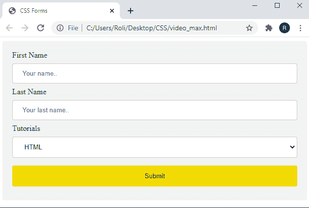
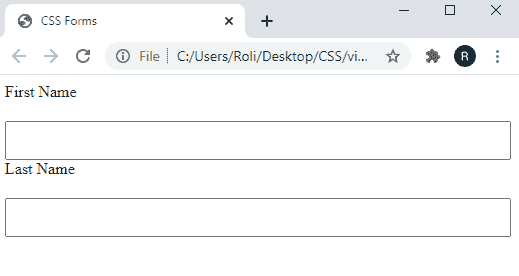
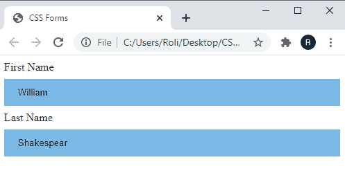
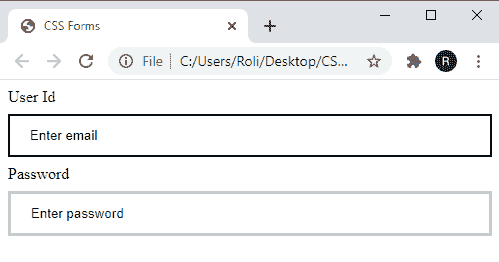
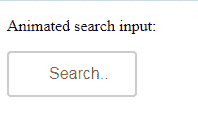
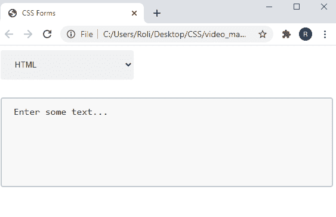

# CSS 表单

> 原文：<https://www.studytonight.com/cascading-style-sheet/css-forms>

基本上，表格是任何网站非常重要的一部分。这是获取用户信息和处理请求的一种方式。表单为应用程序的几乎每一次使用提供了控件。借助表单控件和表单字段，我们可以请求少量和大量的信息，如用户标识和密码、计费信息、作业申请等。

## CSS 中`Forms`的基本结构

要通过表单获取信息，首先，我们必须学会如何创建它。语法如下

要向网页添加表单，我们必须添加`<form>`元素。所有的`input fields`和`form controls`都应该包裹在`<form>`元素中。表单元素有很多可用的属性，但最常用或最重要的是`action`和`method.`

### CSS 中`Forms`的语法

```
<form action="url" method="post">

/* form inputs*/

</form>
```

## CSS 表单中的`Text fields` 和`Text areas`

文本区域和文本字段用于收集用户输入的文本。该输入信息可以是文本、密码、联系号码等。

### CSS 中的`Text fields`

文本字段用于从用户处收集信息。这可以通过使用`<input>`元素及其 `**type**`属性来创建，该属性描述了我们希望用户输入的信息类型。我们也可以借助`name`属性设置输入元素的名称

### CSS 中`Text fields`的语法

```
<input type="text" name="first_name">
```

### CSS 中的`Text Area`

文本区域仅用于获取基于文本的信息。可以使用`<textarea>` 元素创建文本区域字段。这个元素不能接受`type`属性，因为它只接受一种类型的值，但是它接受`name`属性，这意味着用户可以命名`text field`。

### CSS 中`Text Area` 的语法

```
<textarea name="comment">Add your text here.</textarea>
```

`Note:``<input>`元素和`<textarea>`不执行相同的任务。`<input>`字段用于获取电子邮件、电话号码等多种文本，但不超过一行。而`<textarea>`元素用于获取基于长文本的信息，如描述、段落等。

## CSS 表单中的`Other Inputs`和`Menus`

除了基于文本的字段，HTML 还提供了其他输入字段和菜单，如多选和下拉菜单。下面给出了一些最常用的输入和菜单元素:

### CSS 表单中的`Radio Buttons`

当我们想给用户多种选择，但只想要一个回答时，使用单选按钮。单选按钮是使用`<input>`元素创建的，并且`type`属性的值必须是`radio` ( `type="radio"`)。对于一个组中的所有无线电元素，`name`属性的`value`必须相同。

### 示例:在 CSS 表单中创建`Radio Buttons`

```
<input type="radio" name="studytonight" value="HTML" checked>
<input type="radio" name="studytonight" value="CSS">
<input type="radio" name="studytonight" value="Bootstrap">
<input type="radio" name="studytonight" value="JavaScript">
```

### CSS 表单中的`Check Boxes`

复选框还用于在多个选项中选择适当的选项。复选框类似于单选按钮，但它们之间略有不同，即复选框允许用户在所有给定选项中选择多个选项，但单选按钮允许用户在所有选项中仅选择一个选项。要创建复选框，我们必须将 **`type`** 属性的值设置为 `checkbox.`

### 示例:在 CSS 表单中创建`Check Boxes`

```
<input type="checkbox" name="studytonight" value="HTML" checked>
<input type="checkbox" name="studytonight" value="CSS">
<input type="checkbox" name="studytonight" value="Bootstrap">
<input type="checkbox" name="studytonight" value="JavaScript">
```

### `Drop-down`CSS 表单中的列表

当我们想要向用户提供一个长长的选择列表时，使用下拉列表。`drop-down list`是使用`<select>`和`<option>`元素创建的。`<select>`元素包装所有菜单项，每个菜单项都是使用`<option>`元素创建的。

### 示例:在 CSS 表单中创建`Drop-down`列表

```
<select name="tutorial">
  	<option>Select</option>
  	<option value="HTML" checked>HTML</option>
  	<option value="CSS">CSS</option>
  	<option value="JavaScript">JavaScript</option>
  	<option value="Bootstrap">Bootstrap</option>
</select>
```

## CSS 中的其他输入

### CSS 表单中的`Hidden input`

隐藏输入允许我们将数据传递给服务器，而不用让用户知道。它用于跟踪代码、密钥或其他与用户无关但对表单处理有用的信息。

要创建隐藏输入，我们必须将`type`属性的值设置为`hidden`，并为名称和`value`属性设置适当的值。

### CSS 表单中`Hidden input`的语法

```
<input type="hidden" name="tracking-code" value="xyz">
```

### CSS 表单中的`File Input`

文件输入允许用户在表单中添加附件，如文档、pdf、图像等。

要创建文件输入，我们必须将`<input>`元素的`type` 属性的值设置为`file`。

### CSS 表单中`File Input`的语法

```
<input type="file" name="file">
```

## 在 CSS 中组织`Form Elements`

表单元素的更好组织增加了用户的理解，也提供了指导，如实际请求什么以及如何提供信息。这可以在标签、字段集和图例的帮助下完成。

### CSS 表单中的`Label`

标签用于为表单控件提供标题。标签使用`<label>`元素创建。

### CSS 表单中`Label`的语法

```
<label for="username">Username</label>

<input type="text" name="username" id="username">
```

### CSS 表单中的`Fieldset`

Fieldset 用于对表单控件和标签进行分组，并为表单元素提供更好的组织。fieldset 是包装所有表单元素的块级元素。`<fieldset>`元素包括边框轮廓，可以通过应用 CSS 属性进行修改。

### CSS 表单中`Fieldset`的语法

```
<fieldset>
  <label for="username">Username
	<input type="text" name="username" id="username">
  </label>
  <label for="Password">password
	<input type="text" name="password" id="password">
  </label>
</fieldset>
```

### CSS 表单中的`Legend`

图例用于提供表单的标题，从而快速了解表单类型。在打开`<fieldset>`元素后，使用`<legend>`元素创建图例。

### CSS 表单中`Legend` 的语法

```
<fieldset>
		<legend>LogIn Form</legend>
		<label for="username">Username
			<input type="text" name="username">
		</label>
		<label for="password">Password
			<input type="text" name="password">
		</label>
	</fieldset> 
```

## 示例:在 CSS 中创建`login form`

下面给出了带有 CSS 样式属性的基本登录表单:

```
<!DOCTYPE html>
<html>
<head>
	<title>CSS Forms</title>
	<style>
		input[type=text], select {
		  width: 100%;
		  padding: 12px 20px;
		  margin: 8px 0;
		  display: inline-block;
		  border: 1px solid #ccc;
		  border-radius: 4px;
		  box-sizing: border-box;
		}

		input[type=submit] {
		  width: 100%;
		  background-color: orange;
		  color: white;
		  padding: 14px 20px;
		  margin: 8px 0;
		  border: none;
		  border-radius: 4px;
		  cursor: pointer;
		}

		input[type=submit]:hover {
		  background-color: #f2db05;
		  color: black;
		}

		div {
		  border-radius: 5px;
		  background-color: #f2f2f2;
		  padding: 20px;
		}
	</style>
	</head>
<body>
<div>
  <form action="/action_page.php">
    <label for="fname">First Name</label>
    <input type="text" id="fname" name="firstname" placeholder="Your name..">

    <label for="lname">Last Name</label>
    <input type="text" id="lname" name="lastname" placeholder="Your last name..">

    <label for="Tutorial">Tutorials</label>
    <select id="Tutorials" name="Tutorials">
      <option value="HTML">HTML</option>
      <option value="CSS">CSS</option>
      <option value="JavaScript">JavaScript</option>
    </select>

    <input type="submit" value="Submit">
  </form>
</div>

</body>
</html> 
```

### 输出:



## CSS 表单中的`Styling` `Input Fields`

CSS 允许我们通过应用一些 CSS 属性来自行设置输入字段的样式，例如给出背景颜色和调整输入字段的高度和宽度，提供填充和边距等。

### 示例:`Styling input field`使用 CSS

在本例中，我们将 CSS 属性`height`设置为`50px`，将`width`设置为`100%`。

```
<!DOCTYPE html>
<html>
<head>
	<title>CSS Forms</title>
	<style> 
		input {
		  width: 100%;
		  height: 50px;
		}
	</style>
</head>
<body>
<form>
  <label for="fname">First Name</label>
  <input type="text" id="fname" name="fname">
</form>

</body>
</html> 
```

### 输出:

正如我们在输出图像中所看到的，输入场的`height`延伸到`50px`，它占据了整个水平空间，因为我们已经指定了`width`到`100%`。


## CSS 表单中的`Padded Inputs`

CSS 提供了`padding`属性来增加输入到输入字段中的文本和输入字段边框之间的间距。我们可以使用 CSS `margin property`在多个输入字段之间添加额外的空间。

### 示例:CSS 中的`Padded input`字段

在这个例子中，我们设置了 CSS `margin` 属性，在多个输入字段之间提供一些额外的空间，设置了`padding` 属性，在输入字段的边框和里面的内容之间提供空间。

```
<!DOCTYPE html>
<html>
<head>
	<title>CSS Forms</title>
	<style> 
		input[type=text] {
		  width: 100%;
		  padding: 10px;
		  margin-top: 20px;
		  box-sizing: border-box;
		}
	</style>
</head>
<body>
<form>
  <label for="fname">First Name</label>
  <input type="text" id="fname" name="fname">
  <label for="lname">Last Name</label>
  <input type="text" id="lname" name="lname">
</form>

</body>
</html> 
```

### 输出:



## CSS 表单中的样式`Input Borders`

我们可以通过应用多个 CSS 属性以多种方式设置输入边框的样式。我们可以根据需要改变边框的颜色和宽度。它还允许我们只更改输入边框的一侧，或者可以将角变成圆角等等。

### 示例:将 CSS 属性应用于`input borders`

在这个例子中，我们通过使用 CSS 速记属性`border`向输入字段证明边框颜色、边框宽度和边框样式来设置边框样式，并使用 CS `border-radius`属性使边框的角变圆。

```
<!DOCTYPE html>
<html>
<head>
	<title>CSS Forms</title>
	<style> 
		input[type=text] {
		  width: 100%;
		  padding: 12px;
		  margin-top: 12px;
		  box-sizing: border-box;
		  border: 4px solid #025ea1;
		  border-radius: 10px;
		}
	</style>
</head>
<body>
<form>
  <label for="fname">First Name</label>
  <input type="text" id="fname" name="fname">
  <label for="lname">Last Name</label>
  <input type="text" id="lname" name="lname">
</form>

</body>
</html> 
```

### 输出:

正如我们在输出图像中看到的，边框是蓝色的，角是圆形的。


## 在 CSS 表单中创建`colored inputs`

我们可以通过向它们证明`background-color`来使输入变得丰富多彩，也可以通过应用`color`属性来改变文本的颜色。

### 示例:在 CSS 中创建`colored input` `fields`

在这个例子中，我们已经指定了 CSS 属性`background-color`到`#7ab8e6.`这个属性在输入字段中添加了背景颜色。

```
<!DOCTYPE html>
<html>
<head>
	<title>CSS Forms</title>
	<style> 
		input[type=text] {
		  width: 100%;
		  padding: 12px 20px;
		  margin: 8px 0;
		  box-sizing: border-box;
		  border: none;
		  background-color: #7ab8e6;

		}
	</style>
</head>
<body>
<form>
  <label for="fname">First Name</label>
  <input type="text" id="fname" name="fname" value="William">
  <label for="lname">Last Name</label>
  <input type="text" id="lname" name="lname" value="Shakespear">
</form>

</body>
</html> 
```

### 输出:

如我们所见，输入字段的背景颜色变为蓝色。

## 

## CSS 表单中的`Focused Inputs`

我们可以通过向输入字段提供`background color`或提供`border-color`来使输入字段集中。因此，每当用户点击输入字段时，它的背景颜色或者它的边框颜色都会变成不同的颜色。

### 示例:使用 CSS 创建`Focused inputs`

在给定的示例中，我们通过应用两种不同的样式创建了聚焦输入字段。在第一个输入字段中，每当用户点击该字段时，该字段的背景颜色都会变成蓝色，而在第二个输入字段中，当用户点击该字段时，其边框颜色会变成黑色且更宽。

```
<!DOCTYPE html>
<html>
<head>
	<title>CSS Forms</title>
	<style> 
		input[type=email] {
		  width: 100%;
		  padding: 12px 20px;
		  margin: 8px 0;
		  box-sizing: border-box;
		  border: 2px solid black;
		  outline: none;
		}

		input[type=email]:focus {
		  background-color: #7ab8e6;
		}
		input[type=text] {
		  width: 100%;
		  padding: 12px 20px;
		  margin: 8px 0;
		  box-sizing: border-box;
		  border: 3px solid #ccc;
		  -webkit-transition: 0.5s;
		  transition: 0.5s;
		  outline: none;
		}

		input[type=text]:focus {
		  border: 4px solid black;
		}
	</style>
</head>
<body>
<form>
  <label for="userid">User Id</label>
  <input type="email" id="userid" name="userid" value="Enter email">
  <label for="pass">Password</label>
  <input type="text" id="pass" name="pass" value="Enter password">
</form>

</body>
</html> 
```

### 输出:



## `Inserting image/icons`进入 CSS 表单的输入字段

我们可以通过在输入中放入图标/图像来使我们的输入更时尚或更有吸引力。我们可以通过应用 CSS `background-image`属性来添加图标/图像，并且可以借助`background-position`属性来设置定位。

### 示例:使用 CSS 在输入字段中输入`Inserting icon`

在这个例子中，我们已经创建了一个搜索栏，并通过使用`background-image` 属性在其中包含了一个搜索图标。

```
<!DOCTYPE html>
<html>
<head>
	<title>CSS Forms</title>
	<style> 
		input[type=text] {
		  width: 100%;
		  box-sizing: border-box;
		  border: 2px solid #ccc;
		  border-radius: 4px;
		  font-size: 16px;
		  background-color: white;
		  background-image: url('search.png');
		  background-position: 10px 10px; 
		  background-repeat: no-repeat;
		  padding: 12px 20px 12px 40px;
		}
	</style>
</head>
<body>
<form>
  <input type="text" name="search" placeholder="Search..">
</form>
</body>
</html> 
```

### 输出:


## CSS 表单中的`Animated Inputs`

CSS 允许我们使用 CSS `transition`属性设置输入字段的动画。`transition`属性在输入字段中添加`multiple 3D effects`，这使得表单或网页更具交互性。

### 示例:使用 CSS 创建`animated input`字段

在给定的例子中，我们使用 CSS `transition property.`创建了一个搜索框`animate`及其`width` ，因此，当用户点击搜索框时，它将获得整个屏幕的宽度。

```
<!DOCTYPE html>
<html>
<head>
	<title>CSS Forms</title>
	<style> 
		input[type=text] {
		  width: 130px;
		  box-sizing: border-box;
		  border: 2px solid #ccc;
		  border-radius: 4px;
		  font-size: 16px;
		  background-color: white;
		  background-repeat: no-repeat;
		  padding: 12px 20px 12px 40px;
		  transition: width 0.4s ease-in-out;
		}

		input[type=text]:focus {
		  width: 100%;
		}
	</style>
</head>
<body>
<p>Animated search input:</p>
<form>
  <input type="text" name="search" placeholder="Search..">
</form>
</body>
</html> 
```

### 输出:

当我们在输入域内单击时，它将展开并占据整个可用宽度。



## CSS 表单中的样式`Textareas`和`menus`

我们可以通过使用 CSS 属性来修改文本区域和菜单，比如我们可以调整文本区域的大小，为菜单项提供背景颜色等等。

### 示例:使用 CSS 设置`textareas`的样式

在这个例子中，我们使用`<select>`和`<option>`元素创建了一个下拉列表，使用`<textarea>`元素创建了一个文本区域，并设置了多个 CSS 属性为它们提供样式。这些属性是`background-color`、`border-radius`、`border`、`padding`等。

```
<!DOCTYPE html>
<html>
<head>
	<title>CSS Forms</title>
	<style> 
		  select {
		  width: 40%;
		  padding: 16px 20px;
		  border: none;
		  border-radius: 4px;
		  background-color: #f1f1f1;
		  }
		  textarea {
		  width: 100%;
		  height: 150px;
		  margin-top: 30px;
		  padding: 12px 20px;
		  box-sizing: border-box;
		  border: 2px solid #ccc;
		  border-radius: 4px;
		  background-color: #f8f8f8;
		  font-size: 16px;
		  resize: none;
		}
	</style>
</head>
<body>
<form>
  <select id="tutorial" name="tutorial">
  <option value="HTML">HTML</option>
  <option value="CSS">CSS</option>
  <option value="JavaScript">JavaScript</option>
  </select>
</form>
<form>
  <textarea>Enter some text...</textarea>
</form>

</body>
</html> 
```

### 输出:



## CSS 表单中的`Styling Input Buttons`

通过应用 CSS 属性，我们可以通过改变输入按钮的高度、宽度、颜色等来设置输入按钮的样式。

### 示例:`Styling the` `input buttons`使用 CSS

在给定的示例中，我们使用`<button>`元素和`type="button"`属性创建了两个按钮。我们为每个按钮设置多个 CSS 属性，如`background-color`提供`background`、**、**、`margin`、`padding`等中的颜色。

```
<!DOCTYPE html>
<html>
<head>
	<title>CSS Forms</title>
	<style> 
		input[type=button] {
		  background-color: #1994e6;
		  border: none;
		  color: white;
		  padding: 16px 32px;
		  text-decoration: none;
		  margin: 4px 2px;
		  cursor: pointer;
		}
		input[type=submit] {
		  width: 100%;
		 background-color: #0765a3;
		  border: none;
		  color: white;
		  padding: 16px 32px;
		  text-decoration: none;
		  margin: 4px 2px;
		  cursor: pointer;
		}
	</style>
</head>
<body>
<input type="button" value="Button">
<input type="submit" value="Submit">
</body>
</html> 
```

### 输出:


## CSS 中的`Responsive Form`

响应表单会根据屏幕大小自动调整输入字段的高度和宽度。这里给出了一个真实的例子，在这个例子的帮助下，你可以在不同的屏幕尺寸下检查表单的布局，比如当你调整屏幕尺寸时，表单的输入元素会根据屏幕尺寸调整它们。

## 结论

在本课中，我们学习了表单和多表单输入。之后，我们学习了如何使用 CSS 属性来设置这些输入的样式，例如设置输入边框的样式、为输入字段指定背景颜色、使用过渡提供动画等。

* * *

* * *