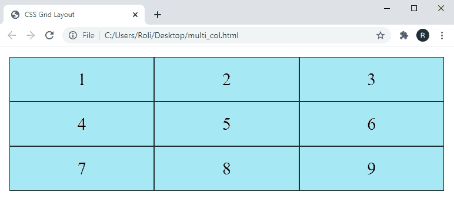
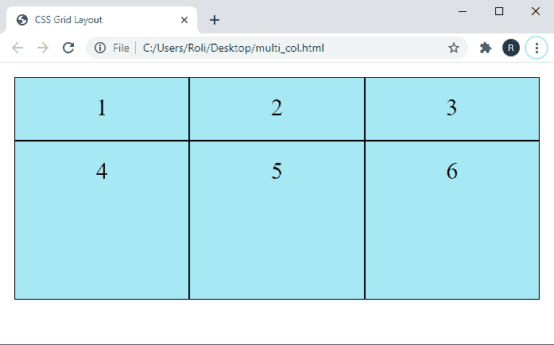

# CSS 网格布局

> 原文：<https://www.studytonight.com/cascading-style-sheet/css-grid-layout>

CSS 网格模块是专门为解决布局问题而设计的，只要我们开始创建网站，我们都一直面临这个问题。CSS 网格布局模块允许我们创建一个具有行和列的复杂且响应迅速的网格布局。以前，我们使用 CSS flexbox、框模型、表格等来创建布局。将项目排列成列和行，但是这些模块缺少很多功能，例如垂直居中。与这些 CSS 模块相比，CSS 网格布局模块克服了与网格布局相关的所有问题，并提供了一种非常简单有效的方法来设计响应性网格布局。

要创建网格布局，我们必须首先创建一个带有 CSS 属性`display: grid;` 的**网格容器**元素，然后网格容器的直接子元素自动成为网格项。

**注意:**在使用 CSS 网格创建网格布局时，不需要使用浮动和定位。

## CSS 网格容器

CSS 网格容器是一个包装器/父元素。为了使一个元素表现得像一个网格容器，我们必须首先设置该元素的 CSS 属性`display: grid | inline-grid;` **。**网格容器中的所有元素以及直接子元素都可以自动成为网格项目。

### 示例:使用 CSS 创建 CSS 网格容器

在给定的示例中，我们通过应用 CSS 属性`display: grid;`使用 **< div >** 元素创建了一个网格容器。这个网格容器也由网格项组成。

```
<!DOCTYPE html>
<html>
<head>
	<title>CSS Grid Layout</title>
	<style>
		.grid-container {
		display: grid;
		grid-template-columns: auto auto auto;
		padding: 10px;
		}
		.grid-item {
		background-color: #a6e9f5;
		border: 1px solid rgba(0, 0, 0, 0.8);
		padding: 20px;
		font-size: 30px;
		text-align: center;
		}
	</style>
</head>
<body>
	<div class="grid-container">
	  <div class="grid-item">1</div>
	  <div class="grid-item">2</div>
	  <div class="grid-item">3</div>  
	  <div class="grid-item">4</div>
	  <div class="grid-item">5</div>
	  <div class="grid-item">6</div>  
	  <div class="grid-item">7</div>
	  <div class="grid-item">8</div>
	  <div class="grid-item">9</div>  
	</div>
</body>
</html> 
```

### 输出:



## CSS 中的网格模板属性

网格模板属性是指定网格列、行和区域的简写属性。grid-template 属性是 grid-column-的简写属性。

* =行、列和区域。

### CSS 网格-模板-行属性

grid-template-rows 属性用于指定网格中每行的高度。这个属性的值是一个用空格分隔的列表，这意味着我们不需要为每一行指定这个属性。我们可以通过在每行之间提供空格来指定它们的值。

### CSS 网格-模板-列属性

grid-template-columns 属性用于指定网格中的列数和每列的宽度。此属性的值是一个用空格分隔的列表，这意味着每列的值都是通过在它们之间提供空格来指定的。

### CSS 网格-模板-行和网格-模板-列属性示例

在给定的示例中，我们使用`grid-template-rows` 属性设置了行的高度，使用`grid-template-columns`属性设置了列的宽度。

```
<!DOCTYPE html>
<html>
<head>
	<title>CSS Grid Layout</title>
	<style>
		.grid-container {
		  display: grid;
		  grid-template-columns: auto auto auto;
		  grid-template-rows: 80px 200px;

		  padding: 10px;
		}

		.grid-container > div {
		  background-color: #a6e9f5;
		  text-align: center;
		  padding: 20px 0;
		  font-size: 30px;
		  border: 1px solid black;
		}
	</style>
</head>
<body>
	<div class="grid-container">
	  <div>1</div>
	  <div>2</div>
	  <div>3</div>  
	  <div>4</div>
	  <div>5</div>
	  <div>6</div>  
	</div>
</body>
</html> 
```

### 输出:



## CSS 中的对齐内容属性

**对齐内容**属性用于对齐网格内的项目。在使用调整内容属性时，我们应该记住一点，网格的宽度应该小于容器的宽度。

该属性有六个不同的值，如下所述:

| **值** | **描述** |
| **均匀间隔** | 此属性用于在列之间或列周围提供相等的空间。 |
| **环绕空间** | 此属性用于使列周围的空间相等。 |
| **间隔-在**之间 | 此属性用于在列之间提供相等的空间。 |
| **中心** | 此属性用于对齐容器中间的网格。 |
| **启动** | 此属性用于对齐容器开头的网格。 |
| **结束** | 此属性用于对齐容器末端的网格。 |

### CSS 对齐内容属性的语法

CSS 对齐内容属性的语法。

```
justify-content: space-evenly | space-around | space-between | center | start | end;
```

### CSS 对齐内容属性示例

在给定的示例中，我们创建了两个网格布局，然后将 `justify-content: space-evenly;` 应用于第一个网格，将`justify-content: space-around;` 应用于第二个网格。

```
<!DOCTYPE html>
<html>
<head>
	<title>CSS Grid Layout</title>
	<style>
		.grid-container {
		  display: grid;
		  justify-content: space-evenly;
		  grid-template-columns: 50px 50px 50px; /*Make the grid smaller than the container*/
		  grid-gap: 10px;
		  background-color: #bab3b3;
		  padding: 10px;
		}

		.grid-container > div {
		  background-color:#7eaeed;
		  text-align: center;
		  padding: 20px 0;
		  font-size: 30px;
		}
		.grid-container1 {
		  display: grid;
		  justify-content: space-around;
		  grid-template-columns: 50px 50px 50px; /*Make the grid smaller than the container*/
		  grid-gap: 10px;
		 background-color: #bab3b3;
		  padding: 10px;
		  margin-top: 30px
		}

		.grid-container1 > div {
		  background-color: #d67c7c;
		  text-align: center;
		  padding: 20px 0;
		  font-size: 30px;
		}
	</style>
</head>
<body>
	<h2>Justify-content: space-evenly</h2>
	<div class="grid-container">
	  <div>1</div>
	  <div>2</div>
	  <div>3</div>  
	  <div>4</div>
	  <div>5</div>
	  <div>6</div>  
	</div>
	<h2>justif-content: space-around;</h2>
	<div class="grid-container1">
	  <div>1</div>
	  <div>2</div>
	  <div>3</div>  
	  <div>4</div>
	  <div>5</div>
	  <div>6</div>  
	</div>
</body>
</html> 
```

### 输出:


## CSS 中的网格区域属性

网格区域属性是网格行开始、网格列开始、网格行结束和列行结束的简写属性。借助于这个属性，我们可以自行设置网格项目的编号。因此，网格项的出现顺序与代码中的顺序不同。

### CSS 网格区域属性示例

在这个例子中，我们已经演示了如何自行排列网格项目。网格区域属性的第一个值设置为网格行开始，第二个值设置为网格列开始，第三个值设置为网格行结束，第四个值设置为网格列结束。

## 结论

在本课中，我们学习了如何使用预定义的 CSS 属性在 CSS 中创建网格。此外，我们还学习了多个网格属性，如下所示:

*   网格-模板-行
*   网格模板列
*   调整内容
*   网格区域

* * *

* * *