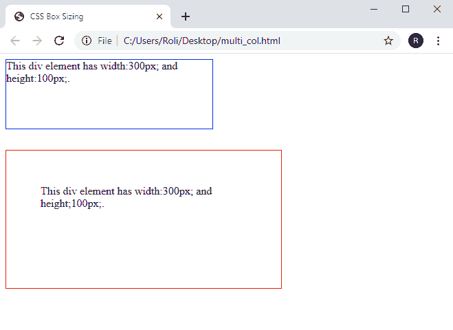
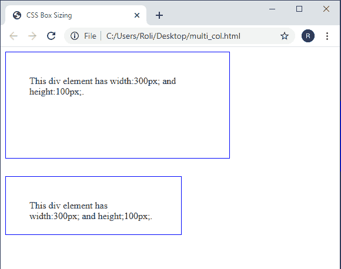

# CSS 框大小

> 原文：<https://www.studytonight.com/cascading-style-sheet/css-box-sizing>

CSS 框大小是一种计算 HTML 元素总高度和总宽度的方法。通常，当我们为任何 HTML 元素指定高度和宽度属性以及填充和边距时。填充和边框的值被添加到元素的高度和宽度值中，元素占用的空间比实际大小多。

在 CSS2 中，元素的高度和宽度计算如下:

宽度+填充+边框=实际宽度

高度+填充+边框=实际高度

上面的公式规定，当我们设置一个 HTML 元素的`padding`和`border`时，它获得的空间比您为该元素设置的实际测量值多一点。这是因为元素的`border`和`padding`属性不包含在元素的指定`height`和`width`中。

### CSS 中框大小属性的语法

```
HTML element/Selector {

/* CSS property */

box-sizing: content-box | border-box | initial | inherit;

}
```

### CSS 中的框大小属性示例

在给定的示例中，我们已经演示了当我们指定元素的`padding`和`border`及其`height`和`width`属性时，元素的大小将大于实际大小。

```
<!DOCTYPE html>
<html>
<head>
	<title>CSS Box Sizing</title>
	<style> 
		.box1 {
		  width: 300px;
		  height: 100px;
		  border: 1px solid blue;
		  margin-bottom: 30px;
		}

		.box2 {
		  width: 300px;
		  height: 100px;  
		  padding: 50px;
		  border: 1px solid red;
		}
	</style>
</head>
<body>
	<div class="box1">This div element has width:300px; and height:100px;.</div>
	<div class="box2">This div element has width:300px; and height;100px;.</div>
</body>
</html> 
```

### 输出:

正如我们在输出图像中看到的，第二个**盒子**比第一个**盒子**大**，即使两个盒子的尺寸相同。这是因为我们用值 **50px** 指定了 CSS **填充**属性，所以第二个框从**到所有边**的距离比第一个框多 **50px** 。**



## 在 CSS 中使用框大小创建框

CSS `box-sizing` 属性包括元素的指定`height`和`width`中的`padding`和`border`宽度。因此，每当用户将`padding`和`border`以及它们的`height`和`width`属性添加到任何元素时，**元素的大小不会变得比实际的大**。为此，我们必须指定 CSS 属性 `**box-sizing: border-box;**`。

### 示例:使用 CSS 框大小属性创建框

在这个例子中，我们使用 **< div >** 元素创建了两个盒子。然后，我们将`border`和 **`padding`** 以及`height`和`width`属性应用到这两个框中。在第二个框中，我们还应用了`box-sizing: border-box;` 属性。所以**第一盒**的尺寸 **比实际尺寸**大，**第二盒**。

```
<!DOCTYPE html>
<html>
<head>
	<title>CSS Box Sizing</title>
	<style> 
		.box1 {
		  width: 300px;
		  height: 100px;
		  border: 1px solid blue;
		  padding: 40px;
		  margin-bottom: 30px;

		}

		.box2 {
		  width: 300px;
		  height: 100px;  
		  padding: 40px;
		  border: 1px solid blue;
  		  box-sizing: border-box;
		}
	</style>
</head>
<body>
	<div class="box1">This div element has width:300px; and height:100px;.</div>
	<div class="box2">This div element has width:300px; and height;100px;.</div>
</body>
</html> 
```

### 输出:



## CSS 中的 CSS 框大小属性值

CSS 提供了四种不同的框大小属性值，如下所示:

| **序列号** | **值** | **描述** |
| **1。** | **边框框** | 高度和宽度属性包括边框、填充和内容。 |
| **2。** | **内容框** | 这是默认值。高度和宽度属性只包括内容，不包括填充和边框。 |
| **3。** | **初始** | 它将 CSS 属性的值设置为默认值。 |
| **4。** | **继承** | 它继承其父元素的 CSS 属性的值。 |

## 实时示例:在 CSS 中应用不同的大小调整属性值

在下面的例子中，我们使用 **< div >** 元素创建了两个盒子。在第一个框中，我们应用了`box-sizing: content-box;`属性，在第二个框中，我们应用了 CSS `box-sizing: border-box;` 属性。

* * *

* * *