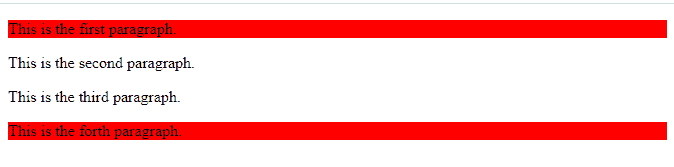
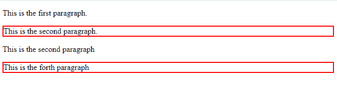
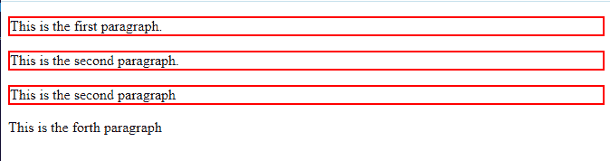
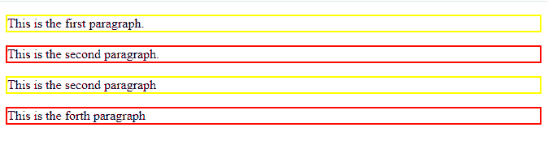
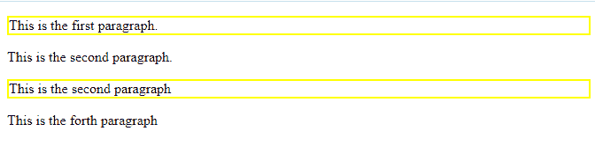

# CSS 属性选择器

> 原文：<https://www.studytonight.com/cascading-style-sheet/css-attribute-selector>

当我们想要为具有相同属性或属性值的多个 HTML 元素设置样式时，会使用 CSS 属性选择器。根据相似的属性对多元素进行分组，这是一种非常方便的样式化方法。属性选择器选择具有特定属性的所有元素，并为所有元素设置样式。默认情况下，属性选择器区分大小写，可以写在方括号[]中。

## 属性选择器的类型

属性选择器有几种类型，如下所示:

*   CSS[属性]选择器
*   CSS[属性= "值"]选择器
*   CSS[属性~= "值"]
*   CSS[属性|= "值"]
*   CSS [attribute^="value"]
*   CSS[属性$= "值"]
*   CSS[属性*=“值”]

## CSS[属性]选择器

`[attribute]`选择器选择包含相同属性的所有元素，并将 CSS 属性一次性应用于所有元素。例如。选择器**【类】**将选择和样式化所有具有相同类名的元素。

### [属性]选择器的语法

```
HTML element[attribute]/[attribute]{

/* CSS properties*/ 

} 
```

### 示例:应用[属性]选择器

在给定的示例中，我们使用 `<p>`元素创建了四个段落。在第一段和最后一段，我们指定了**类**属性及其值**段**，然后我们使用 CSS `[attribute]`选择器为具有****类**属性的`<p>`元素指定了 CSS 属性。**

```
<!DOCTYPE html> 
<html> 
	<head> 
		<title>Attributes selector</title> 
		<style> 
			[class] { 
				background-color: red;
				color: black
			} 

		</style> 
	</head> 
	<body> 
		<p class="para">This is the first paragraph.</p>
		<p>This is the second paragraph.</p>
		<p>This is the third paragraph.</p>
		<p class="para">This is the forth paragraph.</p>
	</body> 
</html> 
```

### 输出:

正如我们在输出图像中看到的，第一段和第四段的背景颜色为红色，这是因为这两段由 class 属性组成。



## CSS[属性= "值"]选择器

这个`[attribute="value"]`选择器允许我们选择和设置所有属性值与指定值相同的元素的样式属性。

### [attribute="value"]选择器的语法

```
HTML element [attribute="value"] {
/* CSS property*/
} 
```

### 示例:应用 CSS[属性= "值"]选择器

在给定的示例中，我们使用`<p>`元素创建了四个段落，并为每个`<p>`元素指定了类属性。现在我们在`[attribute = "value"]`选择器的帮助下分配了类属性的值。该选择器选择其值与选择器的类值相同的类，并且只为这些类设置 CSS 属性。

```
<!DOCTYPE html>
<html>
<head>
	<title>CSS attribute selector</title>
	<style> 
		p[class="para"] {
		  background-color: yellow;
		}
	</style>
</head>
<body>
	<p class="para">This is the first paragraph.</p>
	<p class="test">This is the second paragraph.</p>
	<p class="para">This is the second paragraph</p>
	<p class="test">This is the forth paragraph</p>
</body>
</html> 
```

### 输出:

### 

## CSS[属性~= "值"]选择器

CSS `[attribute~="value"]` 选择器允许我们将 CSS 属性设置为其值包含指定单词的所有元素。

### [属性~= "值"]选择器的语法

```
[attribute~="value"] {

/* CSS property */

property: value;

}
```

### 示例:应用[属性~= "值"]选择器

在本例中，我们为所有四个段落指定了**类属性**。然后，我们为**第一**和**第三段**到**第**段以及为**第二**和**第四**和**段**到**测试**指定了类属性的值。我们使用属性选择器`[class="test"]`用 **2px 纯红**的值指定了 CSS 属性`border`。现在，CSS 指定的 CSS 属性只被那些类属性值为 test 的段落接受。

```
<!DOCTYPE html>
<html>
<head>
	<title>CSS attribute selector</title>
	<style> 
		[class~="test"] {
		  border: 2px solid red;
		}
	</style>
</head>
<body>
	<p class="para">This is the first paragraph.</p>
	<p class="test">This is the second paragraph.</p>
	<p class="para">This is the second paragraph</p>
	<p class="test">This is the forth paragraph</p>
</body>
</html> 
```

### 输出:

正如我们在输出中看到的，CSS 属性只应用于第二段和第四段，因为这两段都有要测试的类属性的值。



## CSS[属性|= "值"]选择器

CSS `[attribute|="value"]`选择器用于选择以特定值开始的具有指定属性的元素。

### CSS[属性|= "值"]选择器的语法

```
[attribute|="value"] {
 /*CSS property*/
}
```

### CSS[属性|= "值"]选择器示例

在给定的例子中，我们已经使用`<p>`标签创建了四个段落，并且我们已经指定了类属性以及值。然后使用 CSS `[class|="para"]`我们指定 CSS 属性`border`，值为 **2px 纯红。**

```
<!DOCTYPE html>
<html>
<head>
	<title>CSS attribute selector</title>
	<style> 
		[ class|="para"] {
		  border: 2px solid red;
		}
	</style>
</head>
<body>
	<p class="para-1">This is the first paragraph.</p>
	<p class="para-2">This is the second paragraph.</p>
	<p class="para-3">This is the second paragraph</p>
	<p class="test">This is the forth paragraph</p>
</body>
</html> 
```

### 输出:

正如我们在输出图像中看到的，只有前三个段落有边框。这是因为我们已经将属性选择器的值指定为 para，它是类属性的指定部分。因此，这个特定的单词与前三个段落相匹配，CSS 属性只能被它们接受。



## CSS [attribute^="value"]选择器

CSS `[attribute^="value"]` 用于选择属性值以特定值开始的值。

### CSS [attribute^="value"]选择器的语法

```
[attribute^="value"] {
/* CSS property*/
}
```

### 示例:应用 CSS [attribute^="value"]选择器

在这个例子中，我们使用`[class^="test"]`而不是任何元素选择器来指定 CSS 属性。因此，我们为具有要测试的类属性的**值的元素指定了 CSS 属性`border`，值为 **2px 实心黄色** ，为具有值 para** 的**类属性指定了`border`属性，值为 **2px 实心红色**。**

```
<!DOCTYPE html>
<html>
<head>
	<title>CSS attribute selector</title>
	<style> 
		[class^="test"]  {
		  border: 2px solid yellow;
		}
		[class^="para"]  {
		  border: 2px solid red;
		}
	</style>
</head>
<body>
	<p class="test-1">This is the first paragraph.</p>
	<p class="para-1">This is the second paragraph.</p>
	<p class="test-2">This is the second paragraph</p>
	<p class="para-2">This is the forth paragraph</p>
</body>
</html> 
```

### 输出:

正如我们在输出图像上看到的，第一段和第三段有黄色边框，第二段和第四段有红色边框。



## CSS[属性$= "值"]选择器

CSS `[attribute$="value"]` 选择器选择属性值以特定值结束的元素。

### 语法 CSS[属性$= "值"]选择器

```
[attribute$="value"] {
   /* CSS properties*/
}
```

### CSS[属性$= "值"]选择器示例

在给定的示例中，我们使用属性选择器[attribute $ =“value”]为`<p>`元素指定了 CSS `border`属性，其类属性值应该包含 1。

```
<!DOCTYPE html>
<html>
<head>
	<title>CSS attribute selector</title>
	<style> 
		[class$="1"]  {
		  border: 2px solid yellow;
		}

	</style>
</head>
<body>
	<p class="test-1">This is the first paragraph.</p>
	<p class="para-1">This is the second paragraph.</p>
	<p class="test-2">This is the second paragraph</p>
	<p class="para-2">This is the forth paragraph</p>
</body>
</html> 
```

### 输出:

正如我们在输出图像上看到的，border 属性只应用于第一段和第二段，这是因为类属性的值在它们的名称中必须包含 1。


## CSS[属性*= "值"]选择器

`[attribute*="value"]`选择器选择属性值包含指定值的元素。

### 语法 CSS[属性*= "值"]选择器

```
[attribute*="value"]{
  /*CSS property*/
}
```

### 示例:应用[属性*= "值"]选择器

在给定的示例中，我们使用`[attribute*="value"]`选择器为 CSS 属性`border`指定了值`2px solid yellow`。所以在这个属性选择器中，我们必须指定属性值的特定部分，而不是整个值。正如我们在给定代码中看到的，我们已经指定了类属性到`te`的**值。这将选择其值由`te`前缀组成的类属性。**

```
<!DOCTYPE html>
<html>
<head>
	<title>CSS attribute selector</title>
	<style> 
		[class*="te"]  {
		  border: 2px solid yellow;
		}

	</style>
</head>
<body>
	<p class="test-1">This is the first paragraph.</p>
	<p class="para-1">This is the second paragraph.</p>
	<p class="test-2">This is the second paragraph</p>
	<p class="para-2">This is the forth paragraph</p>
</body>
</html> 
```

### 输出:

正如我们在输出中看到的，CSS 属性只应用于第一段和第三段，因为这两段的 class 属性值由前缀 te 组成。

### 

## 结论

在本课中，我们学习了 CSS 属性，还学习了如何使用下面给出的属性选择器指定 CSS:

*   CSS[属性]选择器
*   CSS[属性= "值"]选择器
*   CSS[属性~= "值"]
*   CSS[属性|= "值"]
*   CSS [attribute^="value"]
*   CSS[属性$= "值"]
*   CSS[属性*=“值”]

* * *

* * ***