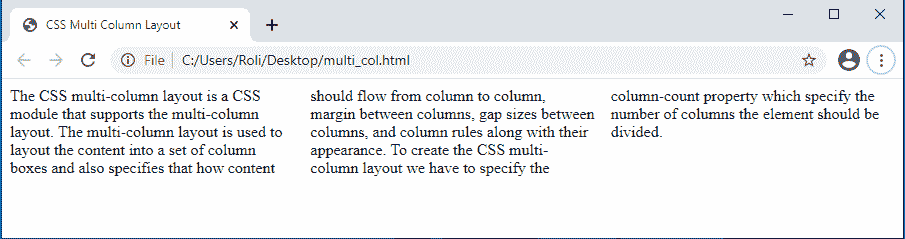
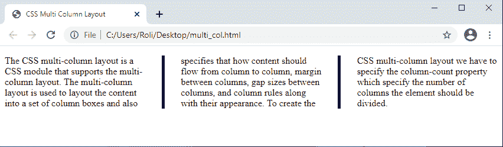

# CSS 多列

> 原文：<https://www.studytonight.com/cascading-style-sheet/css-multicolumn>

CSS 多列布局是支持多列布局的 CSS 模块。多列布局用于将内容布局到一组列框中，并指定内容在列与列之间的流动方式、列与列之间的边距、列与列之间的间隙大小以及列规则及其外观。

## CSS `Multi-column`属性

| **序列号** | **属性** | **描述** |
| **1。** | `column-count` | `column-count`属性指定一个元素应该划分的列数。 |
| **2。** | `column-fill` | `column-fill`属性指定如何填充该列。 |
| **3。** | `column-gap` | `column-gap`属性指定元素的多列之间的间距。 |
| **4。** | `column-rule` | `column-rule`属性是`column-rule-*`的简写属性。 |
| **5。** | `column-rule-color` | `column-rule-color`属性指定列间规则的颜色。 |
| **6。** | `column-rule-style` | `column-rule-style`属性指定列间规则的样式。 |
| **7。** | `column-rule-width` | `column-rule-width`属性指定列间规则的宽度。 |
| **8。** | `column-span` | `column-span` 属性指定元素应该跨越的列数。 |
| **9。** | `column-width` | `column-width`属性指定列的最佳宽度。 |
| **10。** | `columns` | `columns`是一个简写属性，用于指定`column-width`和`column-count`。 |

## 如何在 CSS 中创建`Multi-columns`

为了创建 CSS 多列布局，我们必须指定`column-count`属性，该属性指定元素应该被划分的列数。

### 示例:使用 CSS 创建`multi-column`布局

在给定的例子中，我们使用 `<p>`标签创建了一个段落，然后使用`column-count`属性，我们将这个段落划分为 `three columns`，就像报纸专栏一样。

```
<!DOCTYPE html>
<html>
<head>
	<title>CSS Multi Column Layout</title>
	<style>
	.multi_col{
	  column-count: 3;
	}
	</style>
</head>
<body>
	<p class="multi_col">
	The CSS multi-column layout is a CSS module that supports the multi-column layout. The multi-column layout is used to layout the content into a set of column boxes and also specifies that how content should flow from column to column, margin between columns, gap sizes between columns, and column rules along with their appearance.
	To create the CSS multi-column layout we have to specify the column-count property which specify the number of columns the element should be divided.
	</p>
</body>
</html> 
```

### 输出:

正如我们在输出图像中看到的，该段落现在被分成三列，就像 newspaer 一样。



## 在 CSS 中指定`Gap between columns`

CSS 多列允许我们指定多列之间的间隙。我们可以使用`column-gap`属性设置元素多列之间的间隙大小。

### 示例:在 CSS 中指定`multiple columns`之间的`gap`

在给定的示例中，我们通过为段落指定值为`60px` 的`column-gap`属性，提供了在上一主题中创建的多个列之间的间隙。

```
<!DOCTYPE html>
<html>
<head>
	<title>CSS Multi Column Layout</title>
	<style>
	.multi_col{
	  column-count: 3;
	  column-gap: 60px;
	}
	</style>
</head>
<body>
	<p class="multi_col">
	The CSS multi-column layout is a CSS module that supports the multi-column layout. The multi-column layout is used to layout the content into a set of column boxes and also specifies that how content should flow from column to column, margin between columns, gap sizes between columns, and column rules along with their appearance.
	To create the CSS multi-column layout we have to specify the column-count property which specify the number of columns the element should be divided.
	</p>
</body>
</html> 
```

### 输出:


## CSS〔t0〕

CSS 多列布局允许我们使用 column-rule 属性在元素的多列之间添加一条垂直线。该属性是`column-rule-*`的简写属性，用于使用单个属性设置规则的`width`、`style`和`color` 。

### 示例:为 CSS 中的多列指定`column-rule`属性

在本例中，我们通过用值`5px solid black`指定`column-rule`属性来添加列之间的垂直线。该值创建了一条垂直线，即`thickness`与 `solid patter`和`color is black.`为`5px`

```
<!DOCTYPE html>
<html>
<head>
	<title>CSS Multi Column Layout</title>
	<style>
	.multi_col{
	  column-count: 3;
	  column-gap: 60px;
	  column-rule: 5px solid black;
	}
	</style>
</head>
<body>
	<p class="multi_col">
	The CSS multi-column layout is a CSS module that supports the multi-column layout. The multi-column layout is used to layout the content into a set of column boxes and also specifies that how content should flow from column to column, margin between columns, gap sizes between columns, and column rules along with their appearance.
	To create the CSS multi-column layout we have to specify the column-count property which specify the number of columns the element should be divided.
	</p>
</body>
</html> 
```

### 输出:

正如我们在输出图像中看到的，每一列之间都有一条黑色的水平线。



## CSS〔t0〕

我们可以使用`column-span`属性跨越元素的列。跨越多列的元素称为跨越元素。

### 实时示例:使用`column-span`属性跨越列

在给定的示例中，我们使用 column-span 属性跨越了所有列，但是您也可以跨越特定数量的列。

## 结论

在本课中，我们学习了如何在布局中创建多列，就像报纸版面一样，以及内容如何从一列显示到另一列，列之间的间隙大小，列分割线(称为列规则)及其外观。

* * *

* * *