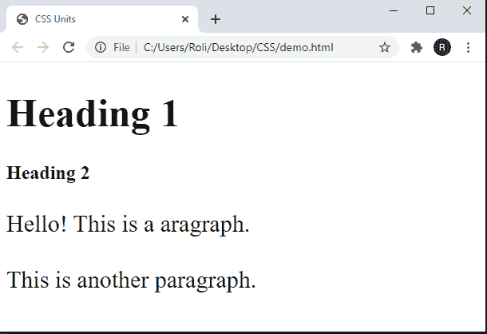
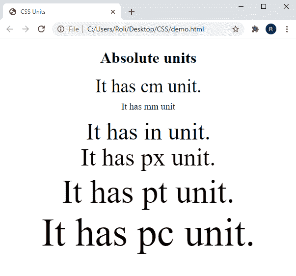

# CSS 单位

> 原文：<https://www.studytonight.com/cascading-style-sheet/css-units>

CSS 单位用于表示我们为特定元素指定的 CSS 属性值的长度/大小。有几个 CSS 属性接受该值为`length`，如`height`、`width`、`margin`、`padding`等。

CSS 单位用于表示长度的性质，我们不能提供长度和它的单位之间的空白。还有一些 CSS 属性也接受负值。

`Note :`长度是一个数字，可以是任何 CSS 属性的值，后跟单位。

### 示例:指定 CSS 属性的长度值以及 CSS 单位

```
<!DOCTYPE html>
<html>
<head>
	<title>CSS Units</title>
	<style>
		h1 {
		  font-size: 50px;
		}

		p {
		  font-size: 30px;
		  line-height: 40px;
		}
	</style>
</head>
<body>
	<h1>Heading 1</h1>
	<h2>Heading 2</h2>
	<p>Hello! This is a aragraph.</p>
	<p>This is another paragraph.</p>
</body>
</html> 
```

### 输出:

### 

## CSS 中的`Length Units`

基本上有两种长度单位，如下所示:

*   绝对长度
*   相对长度

## CSS 中的`Absolute Lengths`

绝对长度是固定长度单位，使用这些长度表示的长度将精确显示为该大小。建议不要在屏幕上使用这些长度，因为屏幕尺寸变化很大。这些长度主要用于输出介质已知的情况，例如打印布局。

| **序列号** | **单位** | **描述** |
| 1. | `cm (Centimeters)` | 它以厘米表示长度。 |
| 2. | `mm (millimeters)` | 它以毫米为单位表示长度 |
| 3. | `in (inches)` | 它以英寸表示长度。(1 英寸= 96px = 2.54cm 厘米) |
| 4. | `px (pixels)` | 它以像素为单位表示长度。(1 像素= 1 英寸的 1/96) |
| 5. | `pt (points)` | 它以磅为单位表示长度。(1pt = 1 英寸的 1/72) |
| 6. | `pc (picas)` | 它用皮卡表示长度。(1pc = 12pt) |

### 示例:在 HTML 元素上应用 CSS `Absolute Length`

在给定的示例中，我们使用 `<p>` 元素创建了段落，并用值`length (in numbers)`为每个段落指定了 CSS 属性`font-size`。每个`length`值由不同的`unit`组成。

```
<!DOCTYPE html>  
<html>  
<head>
	<title>CSS Units</title>  
	<style>  
		body{  
		text-align: center;  
		}  
		p{  
		line-height: 0.1cm;    
		}  
	</style>  
</head>  
<body>  
	<h1> Absolute units </h1>  
	<p style="font-size: 1cm;">It has cm unit.</p>  
	<p style="font-size: 5mm;">It has mm unit</p>  
	<p style="font-size: .5in;">It has in unit.</p>  
	<p style="font-size: 50px;">It has px unit.</p>  
	<p style="font-size: 50pt;">It has pt unit.</p>  
	<p style="font-size: 5pc;">It has pc unit.</p>  
</body>  
</html> 
```

### 输出:



## CSS 中的`Relative Lengths`

相对长度用于响应站点，因为这些长度单位指定了相对于另一个长度属性的长度。当屏幕尺寸变化很大时，这些长度是最佳的，因为它在不同的渲染介质之间可以更好地缩放。这些单元可用作响应单元的默认值。

| **序列号** | **单位** | **描述** |
| 1. | `em` | 该单位用于指定相对于元素字体大小的度量。 |
| 2. | `ex` | 该单位用于指定相对于当前字体 x 高度的度量。 |
| 3. | `ch` | 该单位用于指定相对于“0”宽度的测量值。 |
| 4. | `rem` | 该单位用于指定相对于根元素字体大小的度量。 |
| 5. | `vw` | 该单位用于指定相对于视口 1%宽度的测量值。 |
| 6. | `vh` | 该单位用于指定相对于视口 1%高度的测量值。 |
| 7. | `vmin` | 该单位用于指定相对于视口较小尺寸 1%的测量值。 |
| 8. | `vmax` | 该单位用于指定相对于视口最大尺寸 1%的测量值。 |
| 9. | `%` | 该单位用于指定相对于父元素的度量。 |

### 示例:在 HTML 元素上应用 CSS `relative length`

在本例中，我们使用`<p>` 元素创建了多个段落，并为每个`paragraph.`创建了不同的`relative unit`

 **## 结论

在本课中，我们学习了 CSS 中使用的不同类型的长度单位。基本上有两种长度，如下所示:

`Absolute Lengths -`这些是定长单位。

`Relative Lengths -`这些长度用于响应性网站。

* * *

* * ***