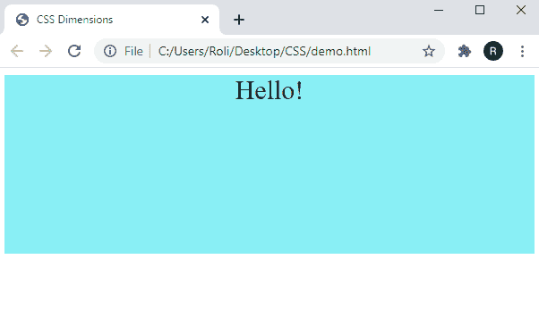

# CSS 维度

> 原文：<https://www.studytonight.com/cascading-style-sheet/css-dimensions>

CSS 尺寸用于设置 HTML 元素的高度和宽度。我们可以在 CSS 高度和宽度属性的帮助下设置 HTML 元素的高度和宽度。

CSS 为设置元素的维度提供了几个属性，如下所示:

| **属性** | **描述** |
| `height` | `height`属性设置 HTML 元素的高度。 |
| `width` | `width`属性设置 HTML 元素的宽度。 |
| `line-height` | `line-height`属性设置一行文本的高度。 |
| `max-height` | `max-height`属性设置元素的最大高度。 |
| `min-height` | `min-height`属性设置元素的最小高度。 |
| `max-width` | `max-width`属性设置元素的最大宽度。 |
| `min-width` | `min-width`属性设置元素的最小宽度。 |

## CSS `Height`和`Width`值

CSS 高度和宽度属性由以下值组成:

| **值** | **描述** |
| `auto` | 这是两个属性的默认值。 |
| `length` | 用户可以用 px、cm 等设置盒子的高度和宽度。 |
| `%` | 用户可以根据其包含的块来设置高度和宽度的值(以%为单位) |
| `initial` | 该值将高度和宽度的值设置为默认值。 |
| `inherit` | 该值从其父元素继承高度和宽度属性值。 |

### 示例:以%为单位指定 HTML 元素的`height`和`width`。

```html
<!DOCTYPE html>
<html>
<head>
<style>
div {
  height: 200px;
  width: 100%;
  background-color:#89eff5;
  text-align: center;
  font-size: 30px;
}
</style>
</head>
<body>
<div>Hello!</div>
</body>
</html> 
```

### 输出:

正如我们在输出图像中所看到的，该框只接受由 CSS 高度和宽度属性指定的高度和宽度。



## CSS 中一个框的`Max-Width`

最大宽度属性用于设置任何元素的最大宽度。该属性的值可以在**长度**、**厘米**、**像素**、 **%** 等中指定。该属性用于克服当用户调整屏幕尺寸小于元素的**高度**和**宽度**时出现的问题，然后浏览器向网页添加侧滚动条。因此，当用户切换到较小的窗口时，此属性改进了对元素的处理。

## 实时示例:指定 HTML 元素的`max-width`

在这个例子中，我们已经设置了元素 500px 的`max-width` 。当我们将屏幕调整到较小时，不会显示侧滚动条。

## 结论

在本课中，我们学习了 CSS 高度和宽度属性的各种值。我们还学习了如何设置 HTML 元素的最大高度和最大宽度。

* * *

* * *