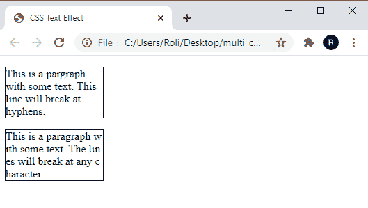

# CSS 文本效果

> 原文：<https://www.studytonight.com/cascading-style-sheet/css-text-effect>

CSS 提供了多种效果属性，我们可以使用它们来设置文本的样式。这些 CSS 文本效果属性非常有用，也使文本变得时尚和更有吸引力。下面给出了一些 CSS 文本效果属性及其描述:

*   文本溢出
*   断字
*   自动换行
*   书写模式

## CSS 文本-溢出

`text-overflow`属性处理溢出的文本的表示。通常，从容器溢出的文本在容器元素之外显示给用户，并与其旁边元素的内容重叠。但是在 CSS 文本溢出属性的帮助下，我们可以隐藏溢出的文本，并向用户发出隐藏文本的信号。

### 该属性有两个值:

*   **剪辑-** 是修剪溢出文本的默认值。
*   **省略号-** 该值显示省略号(...)的位置。

### CSS 文本效果的语法

CSS 文本溢出属性的语法如下:

```html
text-overflow: clip | ellipsis; 
```

### 示例:应用文本效果属性

在给定的例子中，我们已经创建了两个段落，并将它们包装在一个矩形盒子中，盒子的**宽度为**200 px****。然后，我们为每个段落应用了属性`text-overflow` 的两个不同值。在第一段中，通过指定属性 **text-overflow** 到 **clip** 的值来修剪溢出的文本，在第二段中，我们已经指定了值**省略号**。

```html
<!DOCTYPE html>
<html>
<head>
	<title>CSS Text Effect</title>
	<style> 
		p.p1 {
		  white-space: nowrap; 
		  width: 200px; 
		  border: 1px solid #000000;
		  overflow: hidden;
		  text-overflow: clip;
		}

		p.p2 {
		  white-space: nowrap; 
		  width: 200px; 
		  border: 1px solid #000000;
		  overflow: hidden;
		  text-overflow: ellipsis;
		}
	</style>
</head>
<body>
	<p class="p1">This is a paragraph with CSS property text-overflow and value clip.</p>
	<p class="p2">This is a paragraph with CSS property text-overflow and value ellipsis.</p>
</body>
</html> 
```

### 输出:

### 

## CSS 断字

CSS `word-break`属性决定了**单词**应该如何在线路末端断开的规则。断字的缺省值是正常的，当用户没有给它赋值时会自动使用。除此之外，它还有一些值可以在换行时增加效果，如下所示:

*   **keep-all -** 该值在一个完整的单词后换行。
*   **break-all -** 该值将在单词的任何字符处换行，而不使用任何特殊字符。

### CSS 断字属性的语法

断字属性的语法如下:

```html
word-break: normal |keep-all |  break-all | inherit ; 
```

### 示例:应用 CSS 断字属性

在这个例子中，我们已经演示了**保留所有**和**打破所有**值是如何工作的。

```html
<!DOCTYPE html>
<html>
<head>
	<title>CSS Text Effect</title>
	<style> 
		p.p1 {
		  width: 140px; 
		  border: 1px solid #000000;
		  word-break: keep-all;
		}

		p.p2 {
		  width: 140px; 
		  border: 1px solid #000000;
		  word-break: break-all;
		}
	</style>
</head>
<body>
	<p class="p1">This is a pargraph with some text. This line will break at hyphens.</p>
	<p class="p2">This is a paragraph with some text. The lines will break at any character.</p>
</body>
</html> 
```

### 输出:

### 

## CSS 编写模式

CSS `writing-mode`属性指定文本应该水平放置**还是垂直放置**。该属性有三个不同的值**水平-tb** 、**垂直-rl、**和**垂直-lr** 。****

 ****### CSS 编写模式属性的语法

书写模式属性的语法如下:

```html
writing-mode: horizontal-tb | vertical-lr | vertical-rl | inherit ; 
```

这些值的描述如下:

*   **水平-tb:** 是该属性的默认值。该值在水平方向上移动文本，并从左向右和从上到下读取。
*   **垂直-rl:** 显示垂直方向的文字，文字从右到左，从上到下读取。
*   **vertical-lr:** 类似于 vertical-rl，但文字是从左向右读的。

### 示例:应用 CSS 编写模式属性

在给定的示例中，我们使用 **< p >** 标记创建了三个段落。在第一段中，我们将`writing-mode`属性的值指定为**横置-tb** ，对于第二段，我们指定了**`writing-mode: vertical-lr`**，第三段指定了书写模式:竖置-rl。****

```html
<!DOCTYPE html>
<html>
<head>
	<title>CSS Text Effect</title>
	<style> 
		p.p1 {
		  writing-mode: horizontal-tb; 
		}

		span.p2 {
		  writing-mode: vertical-lr; 
		}

		p.p2 {
		  writing-mode: vertical-rl; 
		  font-size: 20px;
		  font-weight: bold;
		}
	</style>
</head>
<body>
	<p class="p1">This is a paragraph with default writing-mode.</p>
	<p>This is a paragraph with <span class="p2">vertical-rl</span> writing-mode.</p>
	<p class="p2">This is a paragraph with writing-mode: vertical-rl.</p>
</body>
</html> 
```

### 输出:


## CSS 自动换行

CSS `word-wrap`属性允许我们将长单词包装到下一行**中，而不会将**打断为**两个或多个单词**。当字符串太长而无法放入容器框时，此属性可避免单词溢出。

这个属性有多个值，它们是普通值、断字值、初始值和继承值。

### CSS 自动换行属性的语法

自动换行属性的语法如下:

```html
word-wrap: normal| break-word | initial | inherit ; 
```

### 示例:应用 CSS 自动换行属性

在给定的示例中，我们使用由一个很长的单词组成的 **< p >** 元素创建了一个段落。基本上，这个长单词不适合容器，并且溢出了，但是通过使用 CSS `word-wrap`属性，这个长单词在下一行换行。

## 结论

在本课中，我们学习了如何为网页中的文本添加文本效果。此外，我们还学习了一些用于给文本添加特殊效果的 CSS 属性。这些属性如下所示:

*   文本溢出
*   断字
*   自动换行
*   书写模式

* * *

* * *********