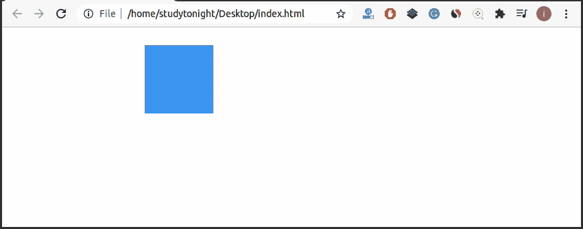

# CSS 动画

> 原文：<https://www.studytonight.com/cascading-style-sheet/css-animation>

## 什么是 CSS 动画？

CSS 动画允许我们用 HTML 元素做一些令人难以置信的事情，使我们的网页更加时尚和优雅。它允许 HTML 元素改变它们的形状，还可以在不使用 javascript 或 flash 的情况下增加它们的运动。要使用 CSS 动画属性制作 HTML 元素的动画，我们必须首先指定两个构建块，它们是:

*   `Keyframes -`关键帧指定元素在特定阶段的风格。
*   `Animation properties -`动画属性被分配给@关键帧，以使动画元素发挥作用。

## `@keyframes`规则

CSS `@keyframes`规则用于通过指定关键帧的 CSS 动画属性以及动画序列来控制 CSS 动画序列中的中间步骤。这个过程对动画序列的中间步骤提供了比过渡更多的控制。

## CSS 动画是做什么的？

动画通过在@关键帧规则中指定 CSS 动画属性，使元素在特定时间从一种样式逐渐变为新样式。要使动画工作，我们必须将动画绑定到一个元素。

## CSS 动画属性

| **序列号** | **属性** | **解释** |
| 1. | `@keyframes` | `@keyframes`用于指定动画。 |
| 2. | `animation` | `animation`是一个简写属性，用于设置一个元素的所有属性。 |
| 3. | `animation-direction` | `animation-direction`属性定义动画何时开始。 |
| 4. | `animation-duration` | `animation-duration` 指定动画完成一个循环需要多长时间。 |
| 5. | `animation-fill-mode` | `animation-fill-mode`指定元素的静态样式。 |
| 6. | `animation-iteration-count` | `animation-iteration-count`指定动画将播放多少次。 |
| 7. | `animation-play-state` | `animation-play-state`指定动画是运行还是暂停。 |
| 8. | `animation-delay` | `animation-delay`指定动画何时开始。 |
| 9. | `animation-name` | `animation-name` 指定@关键帧动画的名称。 |
| 10. | `animation-timing-function` | `animation-timing-function`指定动画的速度曲线。 |

### 示例:在 CSS 中应用动画

在给定的示例中，我们已经使用了所有主要的`CSS animation` 属性来动画化该框。

```
<!DOCTYPE html>
<html>
<head>
  <style> 
  div {
    width: 100px;
    height: 100px;
    background-color: #69e5f5;
    position: relative;
    animation: myfirst 5s linear 2s infinite alternate;
  }

  @keyframes myfirst {
    0%   {background-color: #72e8f7; left:0px; top:0px;}
    25%  {background-color: #409df5; left:200px; top:0px;}
    50%  {background-color: #406ef7; left:200px; top:200px;}
    75%  {background-color: #5a45f7; left:0px; top:200px;}
    100% {background-color: #7a32ed; left:0px; top:0px;}
  }
  </style>
</head>
<body>
  <div></div>
</body>
</html> 
```

### 输出:



## 实例:在 CSS 中应用`animation-timing-property`

在给定的例子中，我们已经使用 CSS 动画-定时-属性指定了元素的速度曲线。动画定时属性由几个值组成，这些值是:

*   `ease -` 这是一个默认值。它指定动画先慢开始，然后快结束，然后慢结束。
*   `linear -` 它指定动画从开始到结束的速度相同。
*   `ease-in -` 它指定动画以缓慢的开始。
*   `ease-out -`指定慢速结束的动画。
*   `ease-in-out -`指定开始和结束较慢的元素。

在给定的实时示例中，我们使用了上面提到的动画定时属性的所有值:

## 结论

在本课中，我们学习了 CSS 动画，它允许元素在特定时间从一种样式更改为另一种新样式。我们还学习了一些最常用的动画属性，如下所示:

*   缓解
*   线性的
*   放松
*   放松
*   放松

* * *

* * *