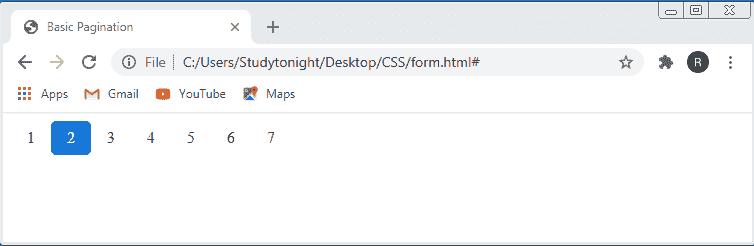
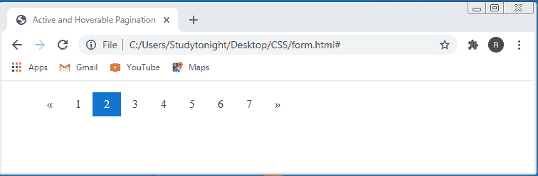
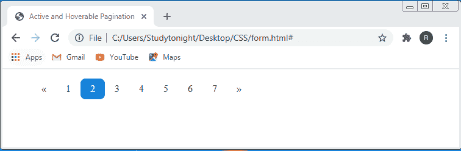
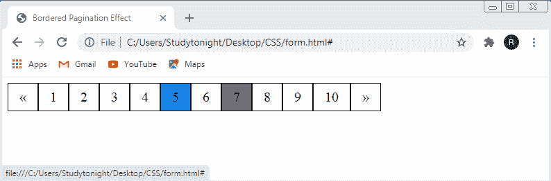

# CSS 页面设置

> 原文：<https://www.studytonight.com/cascading-style-sheet/css-pagination>

分页基本上用于显示一行中的项目。CSS 分页是一种在任何网站的网页上添加连续数字的方式，以便按顺序排列它们。当一个网站由许多页面组成时，就需要为每个页面添加分页，这种技术就被使用了。

分页使查找大量内容变得非常容易，并且可以将网页内容分成多个页面，这使用户能够轻松切换网页内容。

## CSS 中分页的类型

CSS 中有几种分页类型，下面给出了其中的一些:

*   简单分页
*   活动和可悬停分页
*   带有圆形和可悬停按钮的分页
*   带边框分页
*   分页之间居中并留有空间

## CSS 中的简单分页

简单分页是创建分页链接的一种非常基本的方式。要将分页添加到您的网站，您必须添加**。分页**类到 **< ul >** 元素来设置 CSS 样式属性。

### 示例:在 CSS 中创建分页

在本例中，我们演示了如何创建简单的分页。正如我们所知，我们已经使用 **< ul >** 元素创建了链接，这些元素将链接放置在新行中。要并排放置链接，我们必须在 **ul 内指定 CSS **显示**属性，值为**内联**。分页类**。

```
<!DOCTYPE html>  
<html>  
<head>
  <title>Basic Pagination</title>  
  <style>  
    ul.pagination {  
        display: inline-block;  
        padding: 0;  
        margin: 0;  
    }  
    ul.pagination li {display: inline;}  
    ul.pagination li a {  
        color: black;  
        float: left;  
        padding: 8px 16px;  
        text-decoration: none;  
    }
    .pagination li a.active {
  background-color: #1183ed;
  color: white;
  border-radius: 5px;
}  
  </style>  
</head>  
<body>   
  <ul class="pagination">  
    <li><a href="#">1</a></li>  
    <li><a class="active" href="#">2</a></li>  
    <li><a href="#">3</a></li>  
    <li><a href="#">4</a></li>  
    <li><a href="#">5</a></li>  
    <li><a href="#">6</a></li>  
    <li><a href="#">7</a></li>  
  </ul>  
</body>  
</html> 
```

### 输出:

正如我们在输出图像中看到的，数字表示分页，蓝色背景的数字表示活动页面



## CSS 中的活动分页和可悬停分页

当我们想要突出显示当前分页链接，并且希望每当我们将光标移动到链接上时，每个链接的背景颜色都发生变化时，就会使用活动的和可悬停的分页。基本上，我们必须使用**。激活**类和**:悬停**选择器来创建这种效果。

### 在 CSS 中创建活动和可悬停分页的示例

在这个例子中，我们已经演示了如何使用**:悬停**属性，在**激活**和悬停效果的情况下创建分页按钮。

```
<!DOCTYPE html>
<html lang="en">
<head>
  <title>Active and Hoverable Pagination</title>
  <style>
    .pagination li {display: inline;}
    .pagination li a {
    color: black;
    float: left;
    padding: 8px 16px;
    text-decoration: none;
    }
    ul.pagination li a.active {
    background-color: #1183ed;
    color: white;
    }
    ul.pagination li a:hover:not(.active) {background-color: #ddd;}
  </style>
</head>
<body>
<ul class="pagination">
  <li><a href="#">«</a></li>
  <li><a href="#">1</a></li>
  <li><a class="active" href="#">2</a></li>
  <li><a href="#">3</a></li>
  <li><a href="#">4</a></li>
  <li><a href="#">5</a></li>
  <li><a href="#">6</a></li>
  <li><a href="#">7</a></li>
  <li><a href="#">»</a></li>
</ul>
</body>
</html>
```

### 输出:

在给定的输出中，当我们将**光标**移动到任意一个**分页链接**上时，链接的**背景颜色**从**白色**变为**灰色**，**背景颜色蓝色**表示**活动页面**。



## CSS 中带有圆形和可悬停按钮的分页

这个效果非常类似于活动和可悬停效果，但是这个效果由一个附加效果组成，那就是圆角。为了给分页链接添加这个效果，我们必须添加 CSS **边框半径**属性以及**。激活**类和**:悬停**选择器。

### 在 CSS 中创建圆形和可悬停分页按钮的示例

在本例中，我们演示了如何使用**圆角**和**悬停效果**创建**分页按钮**。

```
<!DOCTYPE html>
<html lang="en">
<head>
  <title>Active and Hoverable Pagination</title>
  <style>
    .pagination li {display: inline;}
    .pagination li a {
    color: black;
    float: left;
    padding: 8px 16px;
    text-decoration: none;
    border-radius: 8px;
    }
    ul.pagination li a.active {
    background-color: #1183ed;
    color: white;
    }
    ul.pagination li a:hover:not(.active) {background-color: #ddd;}
  </style>
</head>
<body>
<ul class="pagination">
  <li><a href="#">«</a></li>
  <li><a href="#">1</a></li>
  <li><a class="active" href="#">2</a></li>
  <li><a href="#">3</a></li>
  <li><a href="#">4</a></li>
  <li><a href="#">5</a></li>
  <li><a href="#">6</a></li>
  <li><a href="#">7</a></li>
  <li><a href="#">»</a></li>
</ul>
</body>
</html>
```

### 输出:

正如我们在输出图像中看到的，按钮的角变圆了。



## CSS 中带边框的分页效果

在前面的课程中，分页链接周围没有边框。在本课中，我们将创建带边框的分页效果。

带边框的分页效果由分页链接周围的边框组成。为了给分页链接添加边框，我们必须添加 CSS 边框属性。

### 在 CSS 中创建带边框分页的示例

在本例中，我们演示了如何在分页链接周围创建边框。所以我们在**中添加了**边框**属性，其值为 **1px 纯黑**。分页**类。

```
<!DOCTYPE html> 
<html> 
<head>
<title>Bordered Pagination Effect</title> 
  <style> 
    .pagination { 
      display: inline-block; 
    } 
    .pagination a { 
      font-size:20px; 
      color: black; 
      float: left; 
      padding: 8px 16px; 
      text-decoration: none; 
      border:1px solid black; 
    } 
    .pagination a.active { 
      background-color: #1183ed; 
    } 
    .pagination a:hover:not(.active) { 
      background-color:  #7e7f80; 
    } 
  </style> 
</head> 
<body> 
  <div class="pagination"> 
    <a href="#">«</a> 
    <a href="#">1</a> 
    <a href="#">2</a> 
    <a href="#">3</a> 
    <a href="#">4</a> 
    <a class="active" href="#">5</a> 
    <a href="#">6</a> 
    <a href="#">7</a> 
    <a href="#">8</a> 
    <a href="#">9</a> 
    <a href="#">10</a> 
    <a href="#">»</a> 
  </div> 
</body> 
</html> 
```

### 输出:

正如我们在输出图像中看到的，分页链接周围有边框。



## CSS 中分页之间的居中和空格

分页链接之间的居中空间位于网页的中心，每个链接之间都有空间。为了在分页链接之间创建居中和空间，我们必须添加**文本对齐**属性和值**中心**以将链接放置在中心，并且**边距**属性为**提供链接之间的**空间。

### 在 CSS 中分页之间创建居中和空格的示例

在本例中，我们使用**文本对齐:居中，将分页按钮居中对齐；**属性，为了提供分页链接之间的空间，我们指定了 CSS **边距**，为了提供分页链接的边框与其内部内容之间的空间，我们指定了 CSS **填充**属性。

## 结论

在本课中，我们学习了如何创建分页链接。具有背景颜色的链接表示活动页面。我们还学习了如何以多种方式设计这些链接的样式，例如提供边框、居中对齐分页链接等。

* * *

* * *