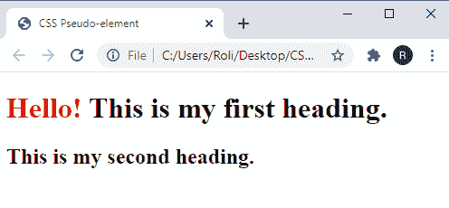
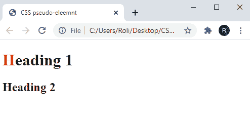

# CSS 伪元素

> 原文：<https://www.studytonight.com/cascading-style-sheet/css-pseudoelement>

伪元素是一个关键字，允许您对 HTML 元素的任何特定部分进行样式化。在伪元素的帮助下，您可以为任何特定的行、单词甚至任何单词的第一个字母设置样式。伪元素从`double-colon (::)`开始。

### CSS 中`Pseudo-element`的语法

```html
selector:: pseudo-element {

/* CSS property*/
property: value;

}
```

**注:**伪元素与伪类的区别在于，`pseudo-elements` 用`double-colon (::)`表示，而在`pseudo-classes`用`single-colon (:)`表示。

## 伪元素

下面给出了一些伪元素:

*   *之后
*   *以前
*   *首字母
*   *一线
*   *甄选

我们将在本课稍后详细讨论它们。

## CSS `::after`伪元素

`::after`伪元素用于在现有的`content`之后增加一些额外的`content/image` 。用户可以借助 CSS `content`属性添加内容，默认`display` 值为`inline`。

### CSS 中`::after`伪元素的语法

```html
HTML element/selector::after {
content: "value";

}
```

### 示例:在 CSS 中应用`::after`伪元素

在给定的示例中，我们使用`<h1>`和`<h2>` 元素创建了两个标题。在第一个标题中，我们通过使用`::after`伪元素和 CSS `content`属性，在句尾插入了`"heading"`一词。

```html
<!DOCTYPE html>
<html>
<head>
	<title>CSS pseudo-element</title>
	<style>
		h1::after {
		  content: " heading.";
		  color: red;
		}
	</style>
</head>
<body>

	<h1>This is my first</h1>
	<h2>This is my second heading.</h2>

</body>
</html> 
```

### 输出:

正如我们在输出中看到的，使用`::after`伪元素和 CSS `content property`将文本“标题”插入到句子的末尾。


## CSS `::before`伪元素

`::before`伪元素用于在现有的`content`之前增加一些额外的`content/image`。用户可以借助 CSS `content` 属性添加内容，其默认显示值为内嵌。

### CSS 中`::before`伪元素的语法

```html
HTML element/selector::before {
/* CSS property */

property: value;

} 
```

### 示例:在 CSS 中应用`::before`伪元素

在给定的示例中，我们借助`<h1>` 和 **`<h2>`** 元素创建了这两个标题。在第一个标题中，我们使用`::before`伪元素和 CSS `content`属性在第一个标题前插入了单词`"Hello"` 。

```html
<!DOCTYPE html>
<html>
<head>
	<title>CSS Pseudo-element</title>
	<style>
		h1::before {
		  content: "Hello! ";
		  color: red;
		}
	</style>
</head>
<body>

	<h1>This is my first heading.</h1>
	<h2>This is my second heading.</h2>

</body>
</html> 
```

### 输出:

在给定的输出中，使用 CSS 属性`content`将文本`"Hello"` 插入到使用`::before`伪元素的句子之前。



## CSS `::first-letter`伪元素

`::first-letter`伪元素用于给特定单词的第一个字母或句子中第一个单词的第一个字母设置样式。使用`::first-letter`伪元素设置的 CSS 属性仅在句子或单词前面没有其他内容(如图像、内嵌表格等)时适用。

### CSS 中`::first-letter`伪元素的语法

```html
HTML element/selector::first-letter {

/* CSS property */

property: value;

} 
```

### 示例:在 CSS 中应用`::first-letter`伪元素

在给定的示例中，我们使用`<h1>` 和`<h2>`元素创建了两个标题。在`first heading,`中，我们只是通过使用`::first-letter` 伪元素和 CSS `color` 属性将第一个字母的颜色从`black`更改为`red`，而标题 2 保持不变。

```html
<!DOCTYPE html>
<html>
<head>
	<title>CSS pseudo-eleemnt</title>
	<style>
		h1::first-letter {
		  color: #ff0000;
		}
	</style>
</head>
<body>

	<h1>Heading 1</h1>
	<h2>Heading 2</h2>

</body>
</html> 
```

### 输出:

从图中我们可以看到`heading 1`的第一个字母的颜色使用`::first-letter`伪元素从`black`变成了`red` 。



## CSS `::first-line`伪元素

`::first-line`伪元素允许我们为一个段落或一个`single sentence`设计风格。使用`::first line`伪元素时要时刻牢记的一点是，行的长度取决于字体大小、元素宽度、文档宽度等诸多因素。

### CSS 中`::first-line`伪元素的语法

```html
HTML element/selector::first-line {

/* CSS property*/

property: value;

}
```

### 示例:在 CSS 中应用`::first-line`伪元素

在给定的示例中，我们使用`<p>` 元素创建了一个`paragraph`。在本文中，我们使用了`::first-line`伪元素来使用 CSS 属性为第一行设置样式。

```html
<!DOCTYPE html>
<html>
<head>
	<title>CSS pseudo-element</title>
	<style>
		p::first-line {
		  background-color:#edc75c;
		  font-size: 20px;
		}
	</style>
</head>
<body>

	<p>The ::first-line pseudo-element allows us to style the first line of a paragraph or a single sentence. One thing always keeps in mind while using::first line pseudo-element is that, the length of the line depends on many factors such as font size, the width of the element, and width of the document.</p>

</body>
</html> 
```

### 输出:

如我们所见，第一行后面有一个背景色。这可以使用`::first-line`伪元素完成，背景颜色可以使用 CSS `background -color`属性指定。


## CSS `::selection`伪元素

每当用户选择特定区域或在其上拖动鼠标时，`::selection`伪元素会改变网页内容的样式。

### CSS 中`::selection`伪元素的语法

```html
::selection {

/* CSS property*/

property: value;

}  
```

### CSS 中的`::selection`伪元素示例

在给定的示例中，我们使用`<p>`元素创建了两个`paragraphs`。因此，每当用户在任何单词或整个段落上选择或拖动鼠标时，在`::selection`伪类和一些指定的`CSS properties`的帮助下，所选区域的样式被改变。

## 结论

在本课中，我们学习了伪元素。此外，我们还学习了如何使用伪元素在现有内容的前后添加内容。伪元素还便于我们为特定部分设置任何单词、句子、段落等的样式。我们可以使用伪元素来设计单词的第一个字母、句子的第一个单词或段落的第一个句子。

* * *

* * *