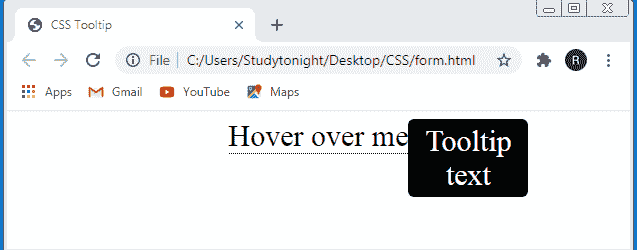
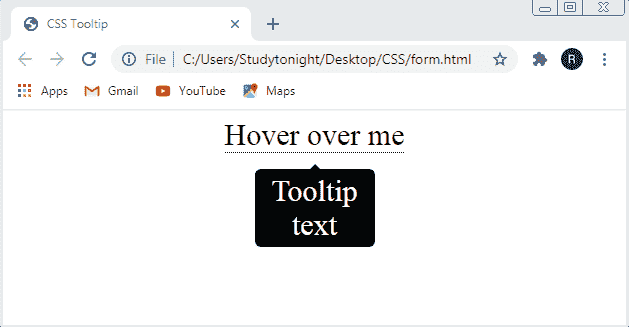
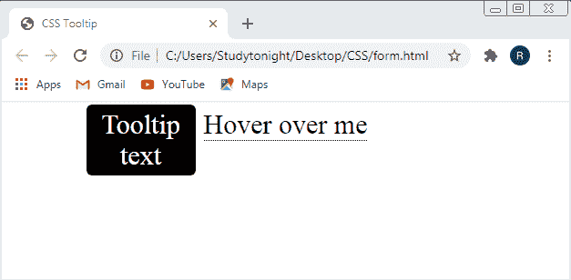

# CSS 工具提示

> 原文：<https://www.studytonight.com/cascading-style-sheet/css-tooltip>

当您将光标移动到某个元素上时，CSS 工具提示用于显示该元素的附加信息。基本上，它是一个小的弹出窗口，只有当您将鼠标移动到特定的链接或元素上时才会出现。

### 示例:如何在 CSS 中创建工具提示

在本例中，我们演示了如何创建工具提示。因此我们为`tooltip`指定了`.tooltip`类，并在其中设置了与工具提示元素相关的所有样式属性，然后我们为`tooltip pop-up window` 指定了另一个类`.tooltiptext`，并在其中设置了与弹出窗口相关的所有样式属性，如下例所示:

```
<!DOCTYPE html>
<html>
<head>
  <title>CSS Tooltip</title>
  <style>
    .tooltip {
        position: relative;
        display: inline-block;
        border-bottom: 1px dotted black;
        font-size: 30px
      }

    .tooltip .tooltiptext {
      visibility: hidden;
      width: 120px;
      background-color: black;
      color: #fff;
      text-align: center;
      border-radius: 6px;
      padding: 5px 0;
      position: absolute;
      z-index: 1;
    } 

    .tooltip:hover .tooltiptext {
      visibility: visible;
    }
  </style>
</head>

<body style="text-align:center;">
  <div class="tooltip">Hover over me
    <span class="tooltiptext">Tooltip text</span>
  </div>
</body>
</html> 
```

### 输出

正如我们在输出图像中看到的那样，`black rectangular box`内的`Tooltip text`是当我们`move the cursor`越过文本`"Hover over me"`时出现的`tooltip window`



## CSS 中的工具提示箭头

工具提示箭头由工具提示弹出窗口组成，该窗口带有一个应该从工具提示特定一侧出现的箭头。您可以使用“顶部”、“底部”、“左侧”和“右侧”属性自行设置工具提示和箭头的位置。

### 创建工具提示箭头的示例

在给定的示例中，我们演示了工具提示箭头，它位于元素的底部，顶部有一个箭头。

```
<!DOCTYPE html>
<html>
<title>CSS Tooltip</title>
<style>
.tooltip {
  position: relative;
  display: inline-block;
  border-bottom: 1px dotted black;
  font-size: 30px;
}

.tooltip .tooltiptext {
  visibility: hidden;
  width: 120px;
  background-color: black;
  color: #fff;
  text-align: center;
  border-radius: 6px;
  padding: 5px 0;
  position: absolute;
  z-index: 1;
  top: 150%;
  left: 50%;
  margin-left: -60px;
}

.tooltip .tooltiptext::after {
  content: "";
  position: absolute;
  bottom: 100%;
  left: 50%;
  margin-left: -5px;
  border-width: 5px;
  border-style: solid;
  border-color: transparent transparent black transparent;
}

.tooltip:hover .tooltiptext {
  visibility: visible;
}
</style>
<body style="text-align:center;">
<div class="tooltip">Hover over me
  <span class="tooltiptext">Tooltip text</span>
</div>

</body>
</html> 
```

### 输出:

正如我们在输出中看到的， `tooltip window` 由它顶部的一个小三角形组成，这个小三角形是一个`arrow` ，它指向文本“`Hover over me`”。当我们将光标移到文本“悬停在我身上”上时，工具提示窗口出现。



## 在 CSS 中指定工具提示位置

CSS 允许我们根据自己的需要和网页上的可用空间来定位工具提示弹出窗口。在指定工具提示窗口的位置时，我们应该记住，当工具提示窗口显示在网页上时，网页的任何其他信息都不会被隐藏。我们可以将工具提示窗口定位到网页上元素的顶部、底部、左侧和右侧。

### 指定工具提示位置的示例

在本例中，我们演示了如何设置工具提示弹出窗口的位置。我们已经将工具提示窗口的`position`设置为元素的`right` ，但是我们也可以将位置设置在**`left`**`top`和`bottom of the element.`****

```
<!DOCTYPE html>
<html>
<head>
  <title>CSS Tooltip</title>
  <style>
    .tooltip {
      position: relative;
      display: inline-block;
      border-bottom: 1px dotted black;
      font-size: 30px;
    }

    .tooltip .tooltiptext {
      visibility: hidden;
      width: 120px;
      background-color: black;
      color: #fff;
      text-align: center;
      border-radius: 6px;
      padding: 5px 0;

      /* Position the tooltip */
      position: absolute;
      z-index: 1;
      top: -5px;
      right: 105%;
    }

    .tooltip:hover .tooltiptext {
      visibility: visible;
    }
  </style>
</head>
<body style="text-align:center;">
  <div class="tooltip">Hover over me
    <span class="tooltiptext">Tooltip text</span>
  </div>
</body>
</html> 
```

### 输出:

我们可以在输出中看到，`tooltip window`在文本“`Hover over me`”的`left`上。



## CSS 中的动画工具提示

动画工具提示是那些有一些动画效果的工具提示。上面创建的工具提示背景简单，但动画工具提示弹出窗口由一些动画效果组成，如`fade-in effect`、`fade-out effect`等。

### 动画工具提示的实时示例

这个实例演示了当你`move`光标`over`文本时，工具提示会`firstfade-in`然后需要 1 秒钟才能回到`actual state.`

## 结论

在本课中，我们学习了如何添加一个弹出窗口来提供额外的文本和信息以及 HTML 元素。我们还学习了如何使用 CSS 属性设置它们的样式，可以将它们的位置设置到元素的顶部、左侧、底部或右侧，并为工具提示窗口提供动画效果。

* * *

* * *****