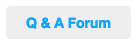
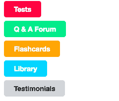

# CSS 将链接样式化为漂亮的按钮

> 原文：<https://www.studytonight.com/cascading-style-sheet/styling-link-into-nice-button>

链接用于链接相关网页。在 HTML 中`<a href="URL"...&gt </a>``<a>`标签用于创建超链接。我们已经学习了如何根据链接的状态来设置链接的样式，即**悬停**、**链接**、**访问**和**活动**。

在本教程中，我们将学习如何使链接看起来像矩形按钮，就像我们在表单中看到的提交按钮，本教程末尾的下一个和上一个按钮，实时示例超链接等。

如果我们有两个样式类，具有不同的样式规则，我们可以将它们一起添加到一个标签中。这里是`clickme`班，

CSS:

```html
.clickme {
    background-color: #EEEEEE;
    padding: 8px 20px;
    text-decoration:none;
    font-weight:bold;
    border-radius:5px;
    cursor:pointer;
}
```

**输出:**



`clickme`是一个样式类，它为链接提供一些基本的样式，比如填充、删除下划线等，使它看起来像一个简单的普通旧按钮。但是是的，将链接转换为按钮的主要任务已经完成。

[现场示例→](/code/playground/web?file=css-styling_link_into_nice_buttons_1)

现在我们将在`clickme`基类的基础上增加更多的样式类，来制作彩色的按钮。

**红色按钮→** `.danger`类

```html
.danger {
    background-color:#FF0040;
    color: #FFFFFF;
}

.danger:hover {
    background-color:#EB003B;
    color: #FFFFFF;
}
```

**HTML:**

```html
<div>
    <a href="http://www.studytonight.com/tests" **class**="*clickme danger*">Tests</a>
</div&g
```

**输出:**


去 **Web 游乐场**现场看看合并后的代码，甚至可以尝试修改一些 css 属性。

[现场示例→](/code/playground/web?file=css-styling_link_into_nice_buttons_2)

* * *

### 大结局！完整的 CSS 时尚按钮集

在这个按钮集中，我们添加了 5 种 uinque 颜色，使用了 5 种不同的 css 样式类，即`danger`、`success`、`warning`、`info`、`default`。

你可以根据你的网站主题改变颜色，或者你甚至可以添加更多的颜色类别。现在去**网络游乐场**看看完整的代码在行动。

**输出:**



[现场示例→](/code/playground/web?file=css-styling_link_into_nice_buttons_3)

我们希望你喜欢这个练习。在我们的现场网络操场上练习([链接](http://www.studytonight.com/code/playground/web))并通过在我们的脸书页面上拍摄输出的快照与我们分享您的风格项目。耶！

* * *

* * *