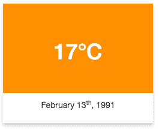

# 使用 CSS 创建卡片

> 原文：<https://www.studytonight.com/cascading-style-sheet/css-cards>

在现代网页设计中，**卡片**被大量使用。卡片看起来很干净，也很像安卓材质的设计。我们可以非常容易地使用`box-shadow`属性创建文本和图片卡。如果你不知道 CSS 属性`box-shadow`，请点击[链接](css-box-model)。

* * *

### 带有 CSS 的图片卡

图片卡可以用来显示文章片段，图片在顶部，文章标题在底部，或者你可以用它来显示用户配置文件，或者其他任何东西。图片卡可以用于多种用途。


```html
.picture-card {
    width: 250px;
    box-shadow: 0 4px 8px 0 grey;
    text-align: center;
} 
```

[现场示例→](/code/playground/web?file=css-css_cards_1)

* * *

### 带有 CSS 的文本卡

文字卡可用于创建日历或天气报告格式等。



```html
.text-card {
    width: 250px;
    box-shadow: 0 4px 8px 0 rgba(0, 0, 0, 0.2);
    text-align: center;
}

.heading {
    background-color: #FF9100;
    color: white;
    padding: 40px 10px;
    font-size: 40px;
}
```

[现场示例→](/code/playground/web?file=css-css_cards_2)

* * *

* * *