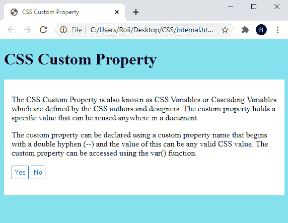

# CSS 自定义属性

> 原文：<https://www.studytonight.com/cascading-style-sheet/css-custom-property>

大型复杂的网站由大量的 CSS 代码组成，有大量重复的 CSS 属性。例如，相同的颜色已经应用于几个元素，如果我们想要改变该颜色，那么从文档中搜索和替换特定的颜色就变得非常困难。为了克服这个问题，引入了 CSS 自定义属性。

## 什么是 CSS 自定义属性？

CSS 自定义属性也称为 CSS 变量或级联变量，由 CSS 作者和设计者定义。自定义属性保存一个特定的值，该值可以在文档中的任何地方重用。

自定义属性可以使用以`double hyphen **(--)**`开头的`custom property name`来声明，其值可以是任何有效的`CSS value`。可以使用 **var()** 功能访问自定义属性。

**注意:**最好使用`:root pseudo-class`定义自定义属性，以便它们可以应用于 HTML 文档中的任何地方。

### CSS 中自定义属性的语法

CSS 自定义属性的语法如下:

```html
HTML element/selector {

/* CSS Property */ 

--main-bg-color: red;

} 
```

## 示例:CSS 中的自定义属性

在给定的示例中，我们在`:root` 伪类中创建了三个自定义类`--blue`、`--white`和`--black` ，这样我们就可以在 HTML 文档的任何地方使用这些自定义属性。然后我们使用< p >元素创建了两个段落。最后，我们使用 CSS `custom property`和`var()`功能设置了这两段的样式属性。可以是`custom classes`之一的自定义属性的值可以放在`var()`函数的括号内。

```html
<!DOCTYPE html>
<html>
<head>
	<title>CSS Custom Property</title>
	<style>
		:root {
		  --blue: #85e1ed;
		  --white: #ffffff;
		  --black: #000000; 
		}

		body {
		  background-color: var(--blue);
		}

		h2 {
		  border-bottom: 2px solid var(--blue);
		}

		.container {
		  color: var(--black);
		  background-color: var(--white);
		  padding: 15px;
		}

	</style>
</head>
<body>
	<h1>CSS Custom Property</h1>
	<div class="container">
	  <p>The CSS Custom Property is also known as CSS Variables or Cascading Variables which are defined by the CSS authors and designers. The custom property holds a specific value that can be reused anywhere in a document. 
	</p>
	  <p>The custom property can be declared using a custom property name that begins with a double hyphen (--) and the value of this can be any valid CSS value. The custom property can be accessed using the var() function. 
	</p>
	</div>
</body>
</html> 
```

### 输出:

正如我们所看到的，HML 元素可以接受指定的 CSS 属性。


## CSS 覆盖变量

如上所述，全局变量可以通过整个 HTML 文档来访问，而局部变量只能在声明它的选择器中访问。假设，如果我们想为任何元素指定任何特定的属性，那么我们必须在本地声明自定义属性。

### 示例:CSS 覆盖变量

在这个例子中，我们使用`<p>`元素创建了两个段落，使用`<button>`元素创建了两个按钮。然后，我们在根元素中创建了三个自定义属性(`--blue`、`--white`、`--black`)和一个名称相同(`--blue`)但值不同的按钮元素的`locally`。因此，当我们为`<button> element`指定自定义属性(`--blue`)时，它将采用本地定义属性的值，而不是全局定义属性的值。

```html
<!DOCTYPE html>
<html>
<head>
	<title>CSS Custom Property</title>
	<style>
		:root {
		  --blue: #85e1ed;
		  --white: #ffffff;
		  --black: #000000; 
		}

		body {
		  background-color: var(--blue);
		}

		h2 {
		  border-bottom: 2px solid var(--blue);
		}

		.container {
		  color: var(--black);
		  background-color: var(--white);
		  padding: 15px;
		}
		button {
  --blue: #0000ff;
  background-color: var(--white);
  color: var(--blue);
  border: 1px solid var(--blue);
  padding: 5px;
}

	</style>
</head>
<body>
	<h1>CSS Custom Property</h1>
	<div class="container">
	  <p>The CSS Custom Property is also known as CSS Variables or Cascading Variables which are defined by the CSS authors and designers. The custom property holds a specific value that can be reused anywhere in a document. 
	</p>
	  <p>The custom property can be declared using a custom property name that begins with a double hyphen (--) and the value of this can be any valid CSS value. The custom property can be accessed using the var() function. 
	</p>
	<div>
    <button>Yes</button>
    <button>No</button>
    </div>
</div>
</body>
</html> 
```

### 输出:

从输出图像中我们可以看到`buttons` 接受了本地定义的自定义属性 `--blue`的值。

### 

## 用 Javascript 更改变量

我们可以使用 JavaScript 更改 CSS 变量，因为 CSS 变量可以访问 DOM。JavaScript 允许我们使用`getPropertyValue()`函数获取自定义属性的值。

## 示例:用 Javascript 更改 CSS 变量

在这个例子中，我们已经演示了如何在运行时使用`getPropertyValue()` 函数获取自定义属性的值。

## 结论

在本课中，我们学习了如何创建可以多次使用的自定义变量并减少代码行。此外，我们还学习了如何使用 CSS 和 Javascript 覆盖它们的值。

* * *

* * *