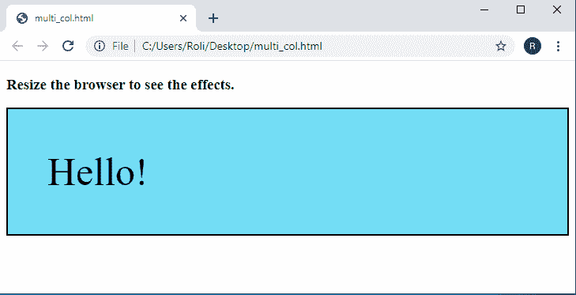

# CSS 媒体查询

> 原文：<https://www.studytonight.com/cascading-style-sheet/css-media-queries>

CSS 媒体查询用于创建响应网页。媒体查询根据网页的屏幕大小或其他特征和参数(如屏幕分辨率和浏览器视口宽度)修改网页的 HTML 元素。

媒体查询用于检查某些事情，例如:

*   视口的高度和宽度
*   设备的高度和宽度
*   设备方向
*   屏幕分辨率

媒体查询由一种媒体类型和无数媒体特征表达式组成。我们还可以在逻辑运算符的帮助下组合多个媒体查询。

借助媒体查询，我们可以为笔记本电脑、台式机、手机等不同尺寸的设备指定不同的 CSS 属性。我们还可以为打印文档或屏幕阅读器指定特定的样式。

### 媒体查询的语法

要将媒体查询添加到 CSS 中，我们必须首先添加`@media`规则，该规则用条件包装元素，这些条件告诉何时何地将 CSS 属性应用到特定元素。

```
@media not|only mediatype and (expression) 
{

HTML element/Selector 
	{

		/* CSS Properties*/
		property: value;

	}

}
```

## CSS 中的`**not**`、**、`only`、**和**、`and`和**关键词

| **关键词** | **描述** |
| **不是** | not 关键字返回整个媒体查询的含义。 |
| **仅** | 限制旧浏览器使用应用于指定样式的媒体功能的媒体查询的唯一功能。 |
| **和** | 和功能用于将媒体功能与一种媒体类型和另一种媒体功能合并。 |

## CSS 中的媒体类型

| **序列号** | **值** | **描述** |
| **1。** | **全部** | 这是用于所有媒体类型的默认值。 |
| **2。** | **打印** | 该值用于打印机。 |
| **3。** | **屏幕** | 该值用于计算机屏幕、平板电脑和智能手机。 |
| **4。** | **发言** | 该值用于屏幕阅读器。 |

### CSS 中的媒体查询示例

在给定的示例中，我们为主体元素指定了 CSS **背景色**属性，其值为 **#e6a7f2** 。当元件的**屏幕宽度**为 **500px 或大于**时，该值可被元件接受。

```
<!DOCTYPE html>
<html>
<head>
	<title>CSS Media Queries</title>
	<style>
		body {
		  background-color: #7edff7;
		}

		@media screen and (min-width: 500px) {
		  body {
		    background-color: #e6a7f2;
		  }
		}
</style>
</head>
<body>
<h1>When you resize the browser, you will e the effect.</h1>
<p>The media query will only apply if the media type is screen and the viewport is 500px wide or wider.</p>
</body>
</html> 
```

### 输出:


## CSS 中的最小宽度和最大宽度

**最小宽度**和**最大宽度**属性用于设置屏幕的最小宽度和最大宽度。当我们想要为特定屏幕大小的元素设置 CSS 属性时，会使用该属性。

因此，`min-width`属性指定设备屏幕或任何元素的最小宽度，`max-width`属性指定设备屏幕或任何元素的最大宽度

### 最小宽度和最大宽度示例

在给定的例子中，我们指定了**最小宽度**到 **400px** 和**最大宽度**到 **750px** ，然后我们指定了一些 CSS 属性。因此，只有当**设备的宽度在 400px 到 750px** 之间时，指定的 CSS 属性才能应用于元素。

```
<!DOCTYPE html>
<html>
<head>
	<meta name="viewport" content="width=device-width, initial-scale=1">
	<title>CSS Media Query</title>
	<style>
		@media screen and (max-width: 750px) and (min-width: 400px) {
		  div.example {
		    font-size: 50px;
		    padding: 50px;
		    border: 2px solid black;
		    background: #73ddf5;
		}
	}
</style>
</head>
<body>
	<h3>Resize the browser to see the effects.</h3>
	<div class="example">Hello!</div>
</body>
</html> 
```

### 输出:

## 

## 列的 CSS 媒体查询

媒体查询允许我们创建一个灵活的布局模块，该模块可以根据不同的屏幕大小将其布局从多列更改为全宽列。

### 示例:使用媒体查询创建响应列

在下面的示例中，我们创建了一个多列布局，该布局根据屏幕大小在四列、两列和全宽布局之间变化。

```
<!DOCTYPE html>
<html>
<head>
	<title>CSS Media Queries</title>
	<style>
		* {
		  box-sizing: border-box;
		}
		.column {
		  float: left;
		  width: 25%;
		  padding: 20px;
		}
		.row:after {
		  content: "";
		  display: table;
		  clear: both;
		}
		@media screen and (max-width: 992px) {
		  .column {
		    width: 50%;
		  }
		}
		@media screen and (max-width: 600px) {
		  .column {
		    width: 100%;
		  }
		}
	</style>
</head>
<body>

<h2>Responsive Multiple Column Layout</h2>
<div class="row">
  <div class="column" style="background-color:#aaa;">
    <h2>Column 1</h2>
  </div>

  <div class="column" style="background-color:#bbb;">
    <h2>Column 2</h2>
  </div>

  <div class="column" style="background-color:#ccc;">
    <h2>Column 3</h2>
  </div>

  <div class="column" style="background-color:#ddd;">
    <h2>Column 4</h2>
  </div>
</div>
</body>
</html> 
```

### 输出:


## 使用 CSS 添加断点

CSS 断点用于使网页布局根据设备的屏幕大小做出响应。它有助于为每个屏幕尺寸的用户做出最佳的布局。这些断点与 CSS 媒体查询一起使用，使网页布局根据指定的屏幕宽度改变其布局。

### 示例:使用媒体查询添加断点

在这个例子中，我们创建了一个网格布局，它会根据屏幕大小改变布局。这可以使用 CSS 媒体查询和断点来完成。

```
<!DOCTYPE html>
<html>
<head>
	<title>CSS Media Queries</title>
	<meta name="viewport" content="width=device-width, initial-scale=1.0">
	<style>
		* {
		  box-sizing: border-box;
		}

		.row::after {
		  content: "";
		  clear: both;
		  display: block;
		}

		[class*="col-"] {
		  float: left;
		  padding: 15px;
		}

		html {
		  font-family: "Lucida Sans", sans-serif;
		}

		.header {
		  background-color: #ff9100;
		  color: #000000;
		  padding: 6px;
		}

		.menu ul {
		  list-style-type: none;
		  margin: 0;
		  padding: 0;
		}

		.menu li {
		  padding: 4px;
		  margin-bottom: 7px;
		  background-color: #f5c92a;
		  color: #000000;
		  box-shadow: 0 1px 3px rgba(0,0,0,0.12), 0 1px 2px rgba(0,0,0,0.24);
		}

		.menu li:hover {
		  background-color: #ff9100;
		}

		/* For desktop: */
		.col-1 {width: 8.33%;}
		.col-2 {width: 16.66%;}
		.col-3 {width: 25%;}
		.col-4 {width: 33.33%;}
		.col-5 {width: 41.66%;}
		.col-6 {width: 50%;}
		.col-7 {width: 58.33%;}
		.col-8 {width: 66.66%;}
		.col-9 {width: 75%;}
		.col-10 {width: 83.33%;}
		.col-11 {width: 91.66%;}
		.col-12 {width: 100%;}

		@media only screen and (max-width: 768px) {
		  /* For mobile phones: */
		  [class*="col-"] {
		    width: 100%;
		  }
		}
	</style>
</head>
<body>
	<div class="header">
	  <h1>Stdytonight</h1>
	</div>

	<div class="row">
	  <div class="col-4 menu">
	    <ul>
	    <li><b>Tutorials</b></li>
	    <li>HTML</li>
	    <li>CSS</li>
	    <li>JavaScript</li>
	    </ul>
	  </div>

	  <div class="col-8">
	    <h1>Studytonight<span style="font-size: 10px;">.com</span></h1>
	    <p>n a world where so much is being done for technology and so little for the environment, education is not even a part of most discussions. We at Studytonight believe that by widening the reach of education, by making it freely available, so much can be achieved.</p>
	    <p><strong>When you resize the browser you will see how the content respond to the resizing.</strong></p>
	  </div>
	</div>
</body>
</html> 
```

### 输出:


## 使用媒体查询设计移动优先布局

术语“移动优先”意味着首先为移动电话(小屏幕设备)设计布局，然后为其他设备(大屏幕设备)设计布局。这将使网页在较小的设备上加载更快，因为超过一半的互联网流量来自小设备。通过在媒体查询中做这些小的改变，我们可以使我们的网页移动化。

在前面的例子中，我们所做的是当屏幕宽度变得小于 768px 时，它的布局发生变化，每一列都自我扩展并开始占据 100%的屏幕宽度，而在移动优先布局中，当宽度变得大于 768px 时，布局发生变化。

### 示例:使用媒体查询创建移动优先设计

在这个例子中，我们使用 CSS 媒体查询创建了一个移动优先的网页布局。

```
<!DOCTYPE html>
<html>
<head>
	<title>CSS Media Queries</title>
	<meta name="viewport" content="width=device-width, initial-scale=1.0">
	<style>
		* {
		  box-sizing: border-box;
		}

		.row::after {
		  content: "";
		  clear: both;
		  display: block;
		}

		[class*="col-"] {
		  float: left;
		  padding: 15px;
		}

		html {
		  font-family: "Lucida Sans", sans-serif;
		}

		.header {
		  background-color: #ff9100;
		  color: #000000;
		  padding: 6px;
		}

		.menu ul {
		  list-style-type: none;
		  margin: 0;
		  padding: 0;
		}

		.menu li {
		  padding: 4px;
		  margin-bottom: 7px;
		  background-color: #f5c92a;
		  color: #000000;
		  box-shadow: 0 1px 3px rgba(0,0,0,0.12), 0 1px 2px rgba(0,0,0,0.24);
		}

		.menu li:hover {
		  background-color: #ff9100;
		}

		[class*="col-"] {
			width: 100%;
		}

		/* For desktop: */
		.col-1 {width: 8.33%;}
		.col-2 {width: 16.66%;}
		.col-3 {width: 25%;}
		.col-4 {width: 33.33%;}
		.col-5 {width: 41.66%;}
		.col-6 {width: 50%;}
		.col-7 {width: 58.33%;}
		.col-8 {width: 66.66%;}
		.col-9 {width: 75%;}
		.col-10 {width: 83.33%;}
		.col-11 {width: 91.66%;}
		.col-12 {width: 100%;}

	</style>
</head>
<body>
	<div class="header">
	  <h1>Stdytonight</h1>
	</div>

	<div class="row">
	  <div class="col-4 menu">
	    <ul>
	    <li><b>Tutorials</b></li>
	    <li>HTML</li>
	    <li>CSS</li>
	    <li>JavaScript</li>
	    </ul>
	  </div>

	  <div class="col-8">
	    <h1>Studytonight<span style="font-size: 10px;">.com</span></h1>
	    <p>n a world where so much is being done for technology and so little for the environment, education is not even a part of most discussions. We at Studytonight believe that by widening the reach of education, by making it freely available, so much can be achieved.</p>
	    <p><strong>When you resize the browser you will see how the content respond to the resizing.</strong></p>
	  </div>
	</div>
</body>
</html> 
```

### 输出:


## CSS 中的典型设备断点

有许多不同高度和宽度的设备和屏幕可供选择。不可能为每个设备创建精确的断点。为了使网页布局具有响应性和移动性，首先，我们为不同的设备将屏幕宽度分为 5 组。

| **属性和屏幕尺寸** | **描述** |
| **最大宽度:600 px** | 该断点用于屏幕宽度小于 600px pr 的超小型设备。 |
| **最小宽度:600 像素；** | 该断点用于屏幕宽度最小为 600px 及以上的平板电脑和大型手机。 |
| **最小宽度:778 像素；** | 该断点用于屏幕宽度最小为 778px 及以上的风景平板电脑。 |
| **最小宽度:992px** | 此断点用于屏幕宽度最小为 992px 及以上的大型设备，如笔记本电脑和台式机。 |
| **最小:宽度:1200px** | 此断点用于屏幕宽度最小为 1200px 及以上的超大型设备，如笔记本电脑和台式机。 |

### 示例:在 CSS 中根据设备的宽度更改背景颜色

在这个例子中，我们为不同的屏幕尺寸设置了多个断点。因此，当我们调整浏览器的大小时，背景颜色会在不同的断点(屏幕大小)发生变化。

```
<!DOCTYPE html>
<html>
<head>
	<title>CSS Media Queries</title>
	<meta name="viewport" content="width=device-width, initial-scale=1.0">
	<style>
		.breakpoint {
		  padding: 20px;
		  color: white;
		}
		/* Extra small devices (phones, 600px and down) */
		@media only screen and (max-width: 600px) {
		  .breakpoint {background: pink;}
		}

		/* Small devices (portrait tablets and large phones, 600px and up) */
		@media only screen and (min-width: 600px) {
		  .breakpoint {background: orange;}
		}

		/* Medium devices (landscape tablets, 768px and up) */
		@media only screen and (min-width: 768px) {
		  .breakpoint {background: blue;}
		} 

		/* Large devices (laptops/desktops, 992px and up) */
		@media only screen and (min-width: 992px) {
		  .breakpoint {background: #f6f799;}
		} 

		/* Extra large devices (large laptops and desktops, 1200px and up) */
		@media only screen and (min-width: 1200px) {
		  .breakpoint {background: purple;}
		}
	</style>
</head>
<body>
<p class="breakpoint">When you resize the browser you will see how the background color of this paragraph changes on different screen sizes.</p>
</body>
</html> 
```

### 输出:


## 使用媒体查询隐藏元素

媒体查询还提供隐藏元素功能。我们可以隐藏特定屏幕设备的元素或内容。假设有一个在大屏幕设备上可见的项目列表，但我们不想在手机等小屏幕设备上显示。所以我们使用媒体查询来实现这一点。

### 示例:使用媒体查询隐藏元素

在这个例子中，我们创建了一个列表，当浏览器的宽度小于或等于 500px 时，这个列表就会被隐藏。

## 结论

在本课中，我们学习了媒体查询的概念、语法等。此外，我们还学到了以下内容

*   媒体类型
*   最小宽度和最大宽度
*   如何使用媒体查询创建列
*   如何添加断点
*   如何设计移动优先布局
*   如何添加典型断点
*   使用媒体查询隐藏元素

* * *

* * *