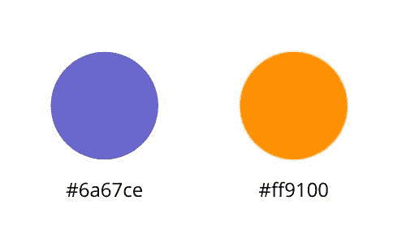

# Sass/SCSS 简介

> 原文：<https://www.studytonight.com/sass/introduction-to-sass-scss>

**Sass(语法上很棒的样式表)**是 CSS 的扩展，它为基本的 CSS 语言增加了语法能力，使开发人员更容易编写 CSS。简单来说，就是一个 CSS 预处理器，让你可以用简单方便的方式编写 CSS。

## 先决条件

在你开始学习 SASS 之前，你应该对 CSS 有所了解。如果你知道它的基本知识，那么你很适合使用 SASS，但是不管怎样，如果你擅长使用 CSS，那么它将帮助你探索更多关于 SASS 的知识。如果你是新手，可以从[这里](https://www.studytonight.com/cascading-style-sheet/)学习 CSS。

## 什么是 SASS？

**Sass(语法上很棒的样式表)**是 CSS 的扩展，它让编写 CSS 代码的整个过程变得更加容易。SASS 就像是 CSS 的新时代版本，它装载了世界各地的开发者希望 CSS 拥有的功能。虽然最新的 CSS3 支持很多新的句法变化，但在很多方面还是有所欠缺。让我们举一个简单的例子，对于今晚的学习网站，我们的原色方案在我们的 CSS 中有紫色和橙色的阴影。



现在，这两种颜色的 Hexa 代码用于不同的 CSS 类，用于设置按钮、文本、背景的样式，您一定在我们网站的不同部分看到过。此外，我们时不时地改变颜色深浅，保持颜色不变，结果我们不得不在 CSS 文件的多个地方改变 Hexa 代码。这是我们在 CSS 中面临的众多问题之一。

使用 SASS/SCSS，我们可以在样式代码的顶部定义变量，给它赋值，它可以是 Hexa 代码或其他任何东西，然后在 CSS 代码中使用变量。

```
$purple: #6A67CE;
$orange: #FF9100;

.purple-btn
{
	text-align: center;
	background-color: $purple;
}
.purple-text
{
	color: $purple;
}
```

在 CSS 中使用与颜色使用相关的 SASS/SCSS 的好处的另一个很好的例子是，它非常容易定义原色的强调色。例如，如果您注意到我们网站上的按钮，当您将鼠标悬停在按钮上或单击按钮时，它们会将颜色更改为稍暗的颜色。在 CSS 中，我们必须像这样指定两种颜色的 Hexa 代码，

```
.purple-btn
{ 
    text-align: center; 
    background-color: #6A67CE; 
}

.purple-btn:hover 
{ 
    background-color: #5653BD; 
}
```

找到正确的颜色，然后在 CSS 文件中更改 Hexa 代码，当你的设计师不断要求不同的颜色时，这就变得非常乏味了。SASS/SCSS 也非常优雅地处理了这个问题。在下面的 SASS 代码中，我们为按钮上的悬停效果定义了比原始颜色深 15%的强调色。

```
$purple: #6A67CE;
$darkpurple: darken($purple, 15%);

.purple-btn 
{
    text-align: center;
    background-color: $purple;
} 
.purple-btn:hover
{
    background-color: $darkpurple;
}
```

这样，我们甚至可以使用禁用效果、悬停效果、选定效果等变量来控制原色的深浅。

**Sass 是一种编译成 CSS 的脚本语言**。SASS 可以被认为是添加在 CSS 上的一个额外的抽象层，使开发人员更容易编写大量的 CSS 代码。使用简单的 SASS 命令，可以很容易地将 SASS 代码转换成 CSS 代码。这种样式表语言最初由**亨利·桑顿**设计，由**娜塔莉·韦森鲍姆**开发。

## 两种语法之间的区别- SASS 与 SCSS

Sass 有两种语法，即 **SCSS** 和 **SASS** ，具有两种不同的文件扩展名`".scss"`和`".sass"`。最常用的是时髦的 CSS 或者仅仅是 SCSS。SCSS 的语法类似于 CSS3 的语法。因此，我们可以说每个 CSS3 样式表也是 SCSS 的。虽然 SASS 是较旧的版本，但编写这两个版本的主要区别之一是使用了分号和括号。旧版本使用行的缩进来指定代码块。无论何时你使用 SCSS，你都需要给予**。scss** 作为你的文件扩展名，**。sass** 否则。我们将在这里讨论最常用的野蛮 CSS(SCSS)。

SCSS 语法是在 Sass 的**版本 3 中引入的。Sass 语法很好，但是引入 SCSS 的一个主要原因是，Sass 的预期语法对于 CSS 来说太陌生了，以至于它的采用变得很困难。那么为什么要花时间学习新的语法呢？因此，创建了 SCSS，其语法类似于 CSS 语法。**

**让我们考虑一个使用这两种语法的例子，**

```
<nav>
    <ul>
        <li>List item</li>
    </ul>
    <a href="https://google.com">Google</a>
</nav>
```

这个 HTML 代码由一个导航条组成，导航条有一个无序列表和一个链接。如果这个 HTML 的样式是用 Sass 语法编写的，那么它将如下所示。

```
 nav
    ul
	margin: 0
	padding: 0
	list-style: none
    li
	display: inline-block
    a
	display: block
	padding: 6px 12px
	text-decoration: none 
```

在上面的 SASS 语法中，可以看到我们使用了缩进来定义块，而不是使用花括号`{ }`。同样，在 **SCSS** 语法中，它将如下所示。

```
 nav {
    ul {
	margin: 0;
	padding: 0;
	list-style: none;
    }
    li {
	display: inline-block;
    }
    a {
	display: block;
	padding: 6px 12px;
	text-decoration: none;
    }
}
```

在 SCSS 语法中，我们使用花括号，就像在 CSS 中一样。为此生成的 **CSS** 如下所示:

```
 nav ul {
    margin: 0;
    padding: 0;
    list-style: none;
}
nav li {
    display: inline-block;
}
nav a {
    display: block;
    padding: 6px 12px;
    text-decoration: none;
} 
```

正如你在上面的例子中看到的，SASS/SCSS 引入了嵌套语法，这种语法更容易理解和编码。这个例子只是为了理解 SASS 和 SCSS 的语法。

## 翻译

转译是把 SASS/SCSS 代码转换成 CSS 代码的过程。这就像编译一样，但是在编译中，一种人类可读的语言被转换/编译成机器可读的格式，而在编译中，一种人类可读的格式被转换成另一种人类可读的格式，即 SASS/SCSS 到 CSS。

你可以很容易地在网上找到 transpiler 工具，将你的 SASS 代码转换成 CSS。

**<u>注意</u> :** **SCSS** 或 **SASS** 文件不能直接包含在 HTML 中，需要先经过编译，生成 CSS 代码，然后在 HTML 文件中使用。

## 为什么要用 SASS/SCSS？

编写 CSS 本身可能很有趣，但是当使用大量 CSS 代码时，很难维护和跟踪不同的模块，而 SCSS 通过引入变量、混合等特性为我们提供了一种解决这些问题的方法。下面提到了 SCSS 的一些好处:

*   它使用嵌套语法，可读性更强。

*   它提供了变量的使用，如上面的例子所示。

*   语法类似于 CSS，因此学习曲线更容易。

*   **函数(mixins)** 可以用 SCSS 创建。

*   也允许**继承**。

在下一个教程中，我们将学习如何在您的开发机器中设置 SASS，并了解一些重要的入门命令。

* * *

* * *