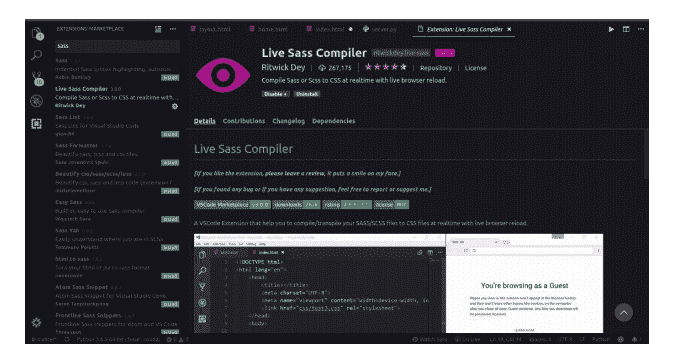

# 安装 Sass 和入门

> 原文：<https://www.studytonight.com/sass/installing-sass-and-getting-started>

让我们从 SASS 编译器的基本设置开始，用 SCSS 设计网页。

## 正在安装 SASS/SCSS

有几种方法可以在计算机上设置 Sass。很少有开源应用程序可以帮助你在几分钟内开始工作(或者)你可以使用命令行安装它(或者)你可以在你著名的代码编辑器上设置它，比如 VScode、Atom、崇高等(或者)使用 GitHub 存储库在任何地方安装它。我们只会详细看到一些好的设置选项，比如**命令行**和[T3】VS 代码编辑器 T5。首先，我们将看到命令行界面安装。](https://code.visualstudio.com/)

### 1.随处安装(独立)

通过从 Github (1.24.5 是截至 2020 年 1 月 17 日的最新版本)下载操作系统[的软件包，然后](https://github.com/sass/dart-sass/releases/tag/1.24.5)[将其添加到您的`PATH`环境变量](https://www.studytonight.com/post/how-to-set-path-environment-variable)中，您可以轻松地在 Windows、Linux、MacOS 上安装 Sass。像这样的安装是最简单的，因为不需要其他依赖项。你所要做的就是下载这个包，保存在某个地方，然后给它添加`PATH`变量。

### 2.使用 NPM 安装

如果您使用 Node.js 或者出于某种原因在您的机器上安装了 NPM([NPM 安装指南](https://www.studytonight.com/post/node-package-manager-npm)，您可以使用以下`npm`命令来安装 sass 包。打开终端，在那里编写并执行以下命令，

`npm install -g sass`

这将在您的系统上安装 Sass 编译器。

### 3.使用自制软件安装(苹果 OSX)

如果你使用的是 MacOS，那么你可以使用自制软件([自制软件安装指南](https://www.studytonight.com/post/what-is-homebrew-and-how-to-install-it-on-mac-osx))在你的机器上安装 Sass。您可以使用以下命令使用自制程序安装 Sass，

```
brew install sass/sass/sass

```

一旦您在计算机上成功安装了 Sass 命令行界面，您就可以运行以下命令来验证您是否正确安装了它，

```
sass --version
```

对于当前版本，您必须获得 **1.24.5** 作为上述命令的输出。此外，您可以使用 sass - help 命令来获取有关命令行界面的更多信息。

## 使用命令行界面将 SCSS 转换为 CSS

您可以使用以下命令将您的 SCSS 代码编译成 CSS 代码。

`sass source/stylesheets/index.scss build/stylesheets/index.css`

在上面的命令中，`sass`是命令，而*源/样式表/索引. scss* 是您的源 scss 文件，*构建/样式表/索引. css* 是存储编译/传输的 css 的目标文件。

## 使用开源应用程序安装

这些将让你在几分钟内启动并运行，你只需要下载它，然后开始使用它作为任何其他代码编辑器。请查看以下应用程序:

*   [指南针 app](http://compass.kkbox.com/)

*   [考拉](http://koala-app.com/)

*   [实时重装](http://livereload.com/)

这些是一些免费的，也有一些付费的，但是免费的对于学习和最初的发展目的来说已经足够了。

## 野蛮人的代码编辑器

这可能是一个更好的选择，因为您可能已经在使用一些著名的代码编辑器。我们将在 VS 代码编辑器和 Atom 代码编辑器中看到设置。VS 代码可能是一个不错的选择，因为它有许多其他功能，如**实时服务器**、**语法高亮**等，这些功能非常有用且易于使用。

### 1.使用 VS 代码进行 Sass

VS 代码中的设置相当简单，因为您在这里需要的只是 [live sass 编译器](https://marketplace.visualstudio.com/items?itemName=ritwickdey.live-sass)扩展。扩展为您提供了默认情况下在 VS 代码中不存在的额外特性。你也可以写自己的扩展。这里我们只详细看 VS 代码扩展。按照以下步骤进行设置。

*   打开 VS 代码编辑器。

*   按下 **Ctrl + Shift + x** 或编辑器左侧的方形图标打开市场(下图中的最后一个)。
    T3】

*   在搜索栏中搜索 **live sass 编译器**，当您打开它时，您应该可以看到这个。按下**安装**按钮安装，就可以开始了。

    

*   现在打开扩展名为**的文件。scss** 并在上面写下你的 scss 代码。你会在底部发现一个小选项，上面写着“看我的野蛮行为”，一旦你点击这个，CSS 地图文件和 CSS 文件将自动生成。您需要将 CSS 文件链接到您的 HTML 代码，而不是 CSS 映射文件。

### 2.用原子做野蛮人

Atom 编辑器也有一个扩展，即[sass-auto mpile](https://atom.io/packages/sass-autocompile)像 VS 代码一样，你可以在给定的链接中找到关于设置的所有说明。

## 结论

有了这个，我们就可以开始使用SASS了，我们知道如何将 SCSS 代码转换成 CSS 代码，然后将生成的 CSS 代码转换成我们的 HTML。在接下来的教程中，我们将学习更多关于在 Sass 中编码的知识。

* * *

* * *