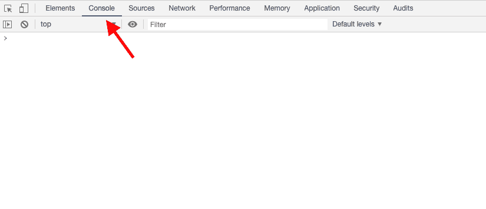

# 用 JavaScript 输出

> 原文：<https://www.studytonight.com/javascript/output-in-javascript>

我们可以在一个网页上用 4 种简单而不同的方法获得 JavaScript 输出，下面给出了这些方法。我们可以根据应用需求使用它们。在本教程中，我们将学习从 JavaScript 代码中获取输出的以下四种不同方式，就像我们在 C 语言中使用`printf()`，在 C++中使用`cout`等一样。

1.  使用`innerHTML`属性

2.  使用`document.write()`方法

3.  使用**警告框**

4.  通过**登录控制台**

我们将借助示例来介绍所有这些内容。此外，如果您不理解这些语法，也不要担心，我们将在接下来的教程中详细介绍这些语法。

## 1.JavaScript `innerHTML`属性

JavaScript 允许您使用 innerHTML 属性写入 HTML 元素。我们可以添加任何我们想要的东西，它可以是一条文本消息，一些 HTML 元素或其他任何东西。

要做到这一点，首先你需要**为你想要通过 JavaScript 代码访问的 HTML 元素**提供一个特定的 Id。

要访问一个 HTML 元素，JavaScript 使用`document.getElementById(id)`方法，其中 **id** 是 HTML 标签的`id`属性的**值。**

举个例子，在这个例子中，`id`属性用来标识 HTML 元素，`innerHTML`属性用来给它设置内容。

这样，如果您正在编写 JavaScript 代码来进行一些处理，或者如果您有任何逻辑，您可以轻松地在 HTML 网页中显示输出。

## 2.使用`document.write()`的 JavaScript 输出

JavaScript 允许您使用`document.write()`方法将任何输出写入到 HTML 网页中。通过使用这种方法，您可以直接将输出写入 HTML 页面。

`write()`方法将 HTML 表达式或 JavaScript 代码写入文档。这种方法主要用于测试目的。

举个例子，在这个例子中，我们使用的是`document.write()`方法，用来直接写入网页。

## 3.通过警告框的 JavaScript 输出

某些网站会在您访问它们或执行某些操作时向您发出警告消息，您会在警告框中看到输出消息。你也可以用 JavaScript 让你的网页发送提醒信息通知用户一些事情，要使用这个功能你需要使用`window.alert()`方法。

让我们举一个例子，在这个例子中，我们使用警报框来编写一条消息并展示给用户。

## 4.JavaScript 控制台日志记录

JavaScript 还允许您创建控制台日志，可以在**浏览器的开发人员工具(Console)** 中看到这些日志，以便进行调试。写在控制台日志中的语句将被执行，但不会显示在浏览器中，而是显示在浏览器的控制台中。

用于控制台记录的功能是`console.log(SOME-EXPRESSION-OR-STRING)`，可以用来记录浏览器控制台中的任何内容。

在 Chrome 浏览器中打开开发者工具，在 Windows 中按 **F12，在 MacOS** 中按**命令+选项+ I。下图显示了它的外观:**



让我们举个例子来看看在控制台中打印日志的 JavaScript 代码:

```
<html>
<head>
    <title>JavaScript console example</title>
    <script>
        console.log(2+3);
    </script>
</head>
<body>
    <!-- HTML body -->
</body>
</html>
```

5

## 结论:

在本教程中，我们学习了如何使用 JavaScript 以各种不同的方式向用户显示输出。所有的例子都包括在内，以便更好地理解这个主题。

* * *

* * *