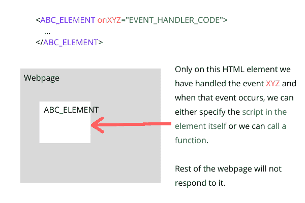

# JavaScript 事件

> 原文：<https://www.studytonight.com/javascript/javascript-events>

JavaScript 事件是交互式网页的**构件。在 JavaScript 中，事件是指网络浏览器在浏览器屏幕上检测到任何用户移动时所检测到的动作。因此，从鼠标移动、键盘点击、悬停在任何特定的 HTML 元素上、表单提交、点击任何输入字段、从下拉列表中选择一个值，以及您在网页上所做的其他一切，浏览器都会为其生成一个事件，可以使用 JavaScript 进行处理。**

JavaScript 使我们能够编写脚本，在这些事件发生时执行。例如`onclick`事件被浏览器检测到每当你点击鼠标按钮并且使用 JavaScript 我们可以在鼠标点击上执行任何动作就像我们可以**设置一个计数器**并且跟踪鼠标点击到**看用户使用鼠标点击的次数**。

在下面的实时示例中，我们已经**实现了一个简单的鼠标点击计数器**，点击输出区域查看点击次数更新为**我们已经在 HTML 页面的整个主体上捕获了鼠标点击事件**。

在上面的代码中，用于在捕获鼠标点击事件时执行动作的函数被称为**事件处理程序**，它在事件被触发时处理特定的事件。

## JavaScript 事件处理语法

以下是为任何 HTML 元素中的任何特定事件添加处理程序的语法。

```js
<ABC_ELEMENT onXYZ="EVENT_HANDLER_CODE"></ABC_ELEMENT>
```

在上面的代码中，我们添加了一个事件处理程序来捕获网页的 **ABC_ELEMENT** 上的 **XYZ** 事件。所以每当 **XYZ** 事件相对于 **ABC_ELEMENT** 发生时，我们的事件处理程序代码就会被执行。



对于事件处理，我们既可以提供一个 JavaScript 函数名，并单独定义该函数，也可以直接在 HTML 标记本身中提供我们的 JavaScript 代码。

我们也可以通过在 **JavaScript** 中指定事件处理部分来做到这一点。

```js
<ABC_ELEMENT is="myTag"></ABC_ELEMENT>

<script>
    function eventHandler() {
        // do something
    } 
    // setup event handler on HTML element
    document.getElementById("myTag").onXYZ = eventHandler;
</script>
```

在上面的语法中，我们已经完全分离了 HTML 和 JavaScript 代码。这是在 JavaScript 中实现事件处理的更好方式。当在 HTML 元素 **ABC_ELEMENT** 中遇到事件 **XYZ** 时，这也会调用`eventHandler`函数。

让我们举几个例子，涵盖几个不同的事件，这样你就可以理解这是如何工作的。

## JavaScript `onchange`事件示例

当一个 HTML 元素如**选择**，或**单选按钮**，或**复选框**等时，该事件被创建。变化。您可以定义一个事件处理程序，以便在此事件发生时执行某些操作。在下面的代码示例中，我们使用`<select>`标签创建了一个下拉列表，其中使用了`<option>`标签向下拉列表添加选项。

现在一旦我们在这个元素上添加了`onchange`事件处理，无论何时使用选择任何值，我们的**事件处理函数都将被执行**。

## JavaScript `onClick`事件示例

当用户单击一个按钮或单击我们已经设置了事件处理程序的任何 HTML 元素时，就会发生此事件。在下面的例子中，我们在`<button>` HTML 标签中设置了一个简单的`onClick`处理程序。

## JavaScript `onmouseover`事件示例

您可以使用`onmouseover`事件使您的网页更具互动性。当我们在任何 HTML 元素上设置此事件处理时，只要用户将鼠标光标放在该 HTML 元素上，事件处理程序就会被触发。

我们可以使用该事件来**改变颜色**、**文本大小**，或者总的来说**创建一个有趣的用户界面**，在鼠标悬停时改变。

## JavaScript `onblur`事件示例

当焦点从任何输入域消失时，JavaScript `onblur`事件被触发。在下面的例子中，我们有一个输入字段，我们已经在其上设置了`onblur`事件处理程序。您可以运行下面的代码示例来查看正在发生的`onblur`事件。

## 与 HTML 表单一起使用的 JavaScript 事件

下面我们列出了所有可以用于 HTML 表单的事件。

| **事件** | **描述** |
| --- | --- |
| 昂松宾 | 提交表单时的触发器 |
| onselect | 选择元素时的触发器 |
| oninvalid | 当元素为时，触发器无效 |
| 推理能力 | 为元素提供输入时触发 |
| onforminput | 在表单上提供输入时触发 |
| onformchange | 当表单更改时触发 |
| 得到焦点时 | 当窗口获得焦点时触发 |
| 上下文菜单 | 使用上下文菜单时触发 |
| 昂哥 | 当元素改变时触发 |
| onblur(声音) | 当窗口失去焦点时触发。 |

## JavaScript 键盘事件

以下是可用于键盘按键的事件。

| **事件** | **描述** |
| --- | --- |
| 叔叔家 | 按键时触发 |
| 按键时 | 按键时触发 |
| onkeyup | 释放钥匙时触发 |

## 超文本标记语言中使用的鼠标事件

我们已经介绍了上面`onmouseover`事件的一个例子，这些是其他可用的鼠标事件。也试试用这些，看看它们能做什么。

| **事件** | **描述** |
| --- | --- |
| 单击事件 | 点击鼠标按钮时触发 |
| ondblclick(点击鼠标) | 双击鼠标按钮时触发 |
| 忍无可忍 | 拖动元素时触发 |
| 羔羊 | 删除被拖动元素时触发 |
| 滚动时触发 | 滚动元素滚动条时触发 |
| 是 mouseup | 释放鼠标按钮时触发 |
| 鼠标滚轮 | 旋转鼠标滚轮时触发 |
| 软骨 | 拖动元素时离开有效目标时触发 |
| 鼠标点下时 | 按下鼠标按钮时触发 |
| 鼠标移动 | 移动鼠标指针时触发 |

## 浏览器的 JavaScript 事件

以下是您可以在 JavaScript 代码中使用的浏览器事件。

| **事件** | **描述** |
| --- | --- |
| onblur(声音) | 当窗口失去焦点时触发 |
| 不良事件 | 发生错误时触发 |
| 得到焦点时 | 当窗口获得焦点时触发 |
| 装载 | 加载文档时触发 |
| onmessage | 当 postMessage()方法向当前文档发送消息时触发 |
| 打印后 | 打印文档后触发 |
| 打印前 | 打印文档前触发 |
| onhaschange | 更改文档时触发 |
| 头上 | 在文档中执行重做操作时触发 |
| 在线 | 文档联机时触发 |

## HTML 媒体元素的 JavaScript 事件

以下是可用于管理 HTML 网页中各种媒体类型的事件，如视频暂停、视频播放等。

| 

**事件**

 | **描述** |
| --- | --- |
| 等待 | 当媒体文件已停止但预计稍后会恢复时触发 |
| ONP 原因 | 暂停媒体文件时触发 |
| 蒙皮 | 当媒体文件将要播放时触发 |
| 开始 | 搜索过程开始时触发 |
| 奥纳博特 | 中止进程时的触发器 |
| 一个提示 | 当媒体元素因某些错误而变空时触发 |
| 合一的 | 当媒体文件结束时触发 |
| onloadeddata | 加载媒体文件时触发 |
| ontimeupdate | 改变媒体文件播放位置时触发 |
| onvolumechange | 更改音量时触发 |

## 在网页开发中使用 JavaScript 事件

事件在创建一个动态的、互动的 web 应用程序时非常有用。应用程序开发过程充满了事件，包括:

*   用于加载应用程序的事件

*   用于单击按钮的事件

*   提交用户表单的事件

*   事件来设置文本框的焦点

*   用于选择元素等的事件。

如果您正在开发一个网站，您应该尝试使用 JavaScript 事件来使您的网页更具响应性，设置客户端验证，处理用户操作等。

我们还列出了上面所有的事件，这样你就可以使用它们，看看它们是如何工作的。在上面的实例中，您可以尝试几乎所有这些事件。

* * *

* * *