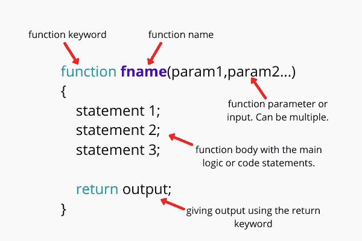

# JavaScript 函数

> 原文：<https://www.studytonight.com/javascript/javascript-functions>

JavaScript Functions，就像任何其他语言一样，是一组用于执行特定任务的语句，例如添加两个数字、查找数字的平方或任何用户定义的任务。

让我们举个例子来理解函数的概念。如果您正在构建一个学生管理应用程序，其中您在注册过程中从学生那里获取数据，然后在身份证打印、标记页打印、任何通知打印或其他任何地方使用这些数据，那么一种方法是，无论您在哪里想要学生数据，您都可以**使用学生 id，查询数据库并找到关于学生的所有信息**。你将不得不在任何你想要学生信息的地方写同样的代码。但是这将导致代码重复，如果你不得不改变获取学生数据的逻辑，你将不得不到处进行改变。


这个问题的**更好的解决方法是定义一个函数**，该函数以**学号作为输入**，查询数据库并返回**学生数据作为输出**，然后**只需调用**就可以在任何我们想要的地方使用这个函数。现在，如果你必须改变逻辑中的一些东西，你可以很容易地做到。

## 函数:定义

现在你有了一个想法，什么是函数，让我们看看它的定义，以及我们如何定义函数，基本的函数结构，以及在 JavaScript 中使用函数。

JavaScript 函数是一组用于执行特定任务的语句。它可以**接受一个或多个输入**，**也可以返回输出**。获取输入和返回输出都是可选的。

使用函数避免了代码的重复，因为我们只需要编写一次代码，然后就可以使用函数名在任何地方调用代码。在以下情况下，函数可能会有所帮助。

*   例如，假设您想要添加一些数字并在网页上显示结果。在这种情况下，您可以定义在函数中添加数字的代码，并在需要时调用该函数。

*   对于重复的任务，比如每当网页被加载到浏览器中时显示一条消息，我们可以使用函数。

下图显示了一个 JavaScript 函数的结构:



如前所述，函数可以是**参数化的**和**非参数化的**，这意味着它们可以接受也可以不接受任何输入。不接受任何参数/输入的函数称为**非参数化函数**。

接受参数/输入的函数必须在括号内用函数名定义(在函数定义之前)，称为**参数化函数**。当我们调用一个函数时，我们可以为这些参数提供自定义值，然后在函数定义中使用。

要从函数返回输出，我们使用`return`语句。

大体上，我们可以将函数分为两类:

1.  用户定义的函数

2.  内置函数

本教程将主要关注用户定义的函数，因为内置函数是 JavaScript 库函数，我们可以在脚本中随时调用它们来使用它们。

## 用户定义函数

如上所述，JavaScript 允许我们根据自己的需求定义自己的函数。让我们了解如何创建自己的函数，并在脚本中调用它们来使用它们。

### 创建用户定义的函数:

在 JavaScript 中，函数是通过使用`function`关键字后跟**函数名**和括号`( )`来定义的，以保存参数(输入)。一个函数可以有**零个或多个参数，用逗号**隔开。

**函数体被括在花括号**中，就在函数声明部分(函数名和参数)之后，在函数体的末尾，如果我们愿意，我们可以有一个`return`语句来返回一些输出。

以下是 JavaScript 用户定义函数的语法:

```
function function_name(parameter-1, parameter-2,...parameter-n)
{
    // function body
}
```

其中，**函数名**代表函数名，**参数-1，...，参数-n** 代表参数列表。

### 调用用户定义的函数:

创建函数后，我们可以在脚本中的任何地方调用它。调用函数的语法如下:

```
function_name(val-1, val-2, ..., val-n);
```

这里，参数列表表示在函数调用期间传递给函数的值，函数已经在函数定义中指定了这些值。如果一个函数没有任何参数，那么我们在调用该函数时就不必提供任何值。

### 用户自定义功能`return`语句:

一个函数可能有也可能没有`return`语句，因为不是所有函数都返回输出。`return`语句用于指定函数返回的值/结果/输出。

在函数定义中有一个`return`语句是完全可选的。执行`return`语句是函数的最后一个动作，在执行`return`语句之后，执行控制传递回调用语句，这意味着执行控制退出函数。

以下是使用 return 语句的语法:

```
return value;
```

`return`关键字返回调用语句的值。

### 用户定义函数示例:

理论讲够了，现在我们来看一些例子。

```
<html>
    <head>
        <script>
            function mySumFunction(a, b)
            {
                // return the result
                return a+b;
            }

            let x = myFunction(8, 7);
            alert(x);
        </script>
    </head>
</html>
```

上面我们定义了一个简单的函数来求两个数的和并返回结果。让我们再举一些例子来看看 JavaScript 用户定义函数的作用。

在下面的用户定义函数中，我们只是使用`innerHTML`属性向一个 HTML 元素添加了一些文本。

**带参数的函数示例:**在下面的示例中，我们定义了一个简单的乘法函数，该函数将两个数值作为输入，并将它们相乘并返回结果。

**另一个函数示例:**在下面的示例中，我们有一个名为`sum()`的函数，它接受三个参数。在调用函数时，当我们为函数参数提供值时，我们将其称为**参数**。

## JavaScript 内置函数

JavaScript 本身作为脚本语言的一部分提供的函数被称为**内置函数**。JavaScript 提供了一套丰富的库，其中有许多内置函数。内置功能的例子有:`alert()`、`prompt()`、`parseInt()`、`eval()`等。

## 作为对象的函数

是的，你读对了。**JavaScript 中的函数也被视为对象**，可以赋给变量。一旦我们给一个变量分配了一个函数，我们就可以使用变量名来调用这个函数。

让我们举个例子。

```
let x = function someFunction(y) {
            document.write("Function called with value: " + y);
        }

// we can call the function using the variable now
x(10);
```

用值调用的函数:10

### 结论:

在本教程中，我们详细介绍了 JavaScript 函数的概念，包括函数的基础知识、我们为什么需要它们、函数的结构、如何定义它们、如何调用它们，以及示例。

* * *

* * *