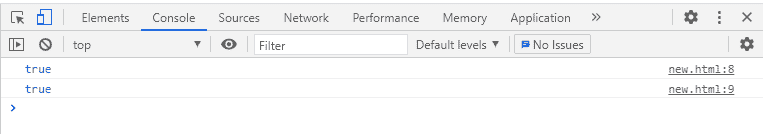

# Javascript BigInt

> 原文：<https://www.studytonight.com/javascript/javascript-bigint>

我们知道，JavaScript 只有一个**数字的**数据类型****，这是一个**数字类型**。这种数据类型代表 64 位浮点数。它还表示小于 2^53 的整数。为了表示比**更大的**数字，引入了 2^53-1** 、 **BigInt** 。**

**BigInt** 是一个**内置对象**，表示比 **2^53-1** 大的**整数，是 **JavaScript** 能够表示的最大值。对于一个 **BigInt 数值**可以有多长没有具体的限制，在行为上， **BigInt 数值**与**数值**非常相似，但它们之间略有不同。我们不能使用内置数学对象**的 BigInt 值。

## 如何创建 BigInt？

嗯，我们可以用`BigInt()`方法创建一个 BigInt 类型的对象，`BigInt()`的语法如下:

```
BigInt()
```

### 示例:

```
<!DOCTYPE html>
<html>
<head>
	<title>BigInt</title>
</head>
<body>
<script>
	const bigNum = BigInt(9007199254740991)
	console.log(bigNum);
	const hugeStr = BigInt("9007199254740991")
	console.log(hugeStr);
	const hexNum = BigInt("0x1fffffffffffff")
	console.log(hugehex);
	const octalNum = BigInt("0o377777777777777777")
	console.log(octalNum);
	const binaryNum = BigInt("0b11111111111111111111111111111111111111111111111111111")
	console.log(binaryNum);
</script>
</body>
</html>
```

### 输出:


## 将运算符与 BigInt 一起使用

**BigInt 类型**支持所有 JS 操作符，尤其是这些`+`、`*`、`-`、`%`、`**`。除了`>>>`和一元`+`运算符外，BigInt 还支持**按位运算符**。**除运算符** ( `/`)也将使用**整数**s，但结果不会是任何**小数位数**。

### 示例:

在本例中，我们使用除法运算符(`/`)对两个整数进行了除法运算，该运算符返回舍入值 **2** 而不是 **2.5** 。这是因为在 **BigInt 上执行的所有操作都会返回 BigInt** 。

```
<!DOCTYPE html>
<html>
<head>
	<title>BigInt</title>
</head>
<body>
<script>
	const wholeNum = 5n / 2n
	console.log(wholeNum);
</script>
</body>
</html>
```

### 输出:


## BigInt 的比较

一个**大整数**不是**严格等于**一个**数**，但可以是**宽松等于**。这意味着当我们使用严格相等的**将两个 BigInt 值与(`===`)进行比较时，结果为假，但是当我们使用宽松相等的**将相同的值与(**)进行比较时，结果将显示为真。**

让我们用例子来更好地理解它。

### 示例:

```
<!DOCTYPE html>
<html>
<head>
	<title>BigInt</title>
</head>
<body>
<script>
	console.log(2n === 2);
	console.log(2n == 2);  
</script>
</body>
</html>
```

### 输出:

我们可以看到，**第一个表达式**的输出是**假**，而**第二个表达式**是**真**。


## BigInt 中的条件句

在以下情况下，一个**大数值**的行为类似于一个**数值**:

*   使用`boolean()`功能将 **BigInt** 值转换为**布尔值**时

*   与逻辑运算符如`||`、`&&`和`!`一起使用时。

*   在条件测试中，如`if()`语句。

### 例子

```
<!DOCTYPE html>
<html>
<head>
	<title>BigInt</title>
</head>
<body>
	<script>
		let count = 0n;

		if(count) {
			console.log("Hello");
		} 
		else {
			console.log("Bye");
		} 
	</script>
</body>
</html>
```

### 输出:

在上面的例子中，BigInt 值作为一个数字，它的值被视为 0，因此，else 块被执行，因为在 if-else 语句中 **0 值转换为 false** 。


## 带`typeof`运算符的 BigInt

BigInt 的类型是 BigInt。所以当我们用带 BigInt 的`typeof`运算符知道 BigInt 的数据类型时，它会返回 BigInt 类型。

### 示例:

下面是一个简单的代码示例，

```
<!DOCTYPE html>
<html>
<head>
	<title>BigInt</title>
</head>
<body>
	<script>
		console.log(typeof BigInt(100) === 'bigint'); 
		console.log(typeof 1n === 'bigint')
	</script>
</body>
</html>
```

### 输出:



## 结论

`BigInt()`方法在 **ECMAScript 2020** 或 **ES11** 中介绍。该方法用于表示大于 **2^53 - 1** 的整数。此方法用于创建用于执行复杂数学计算的值。

* * *

* * *