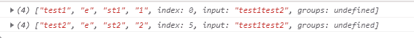

# Javascript ES11 `matchAll()`函数

> 原文：<https://www.studytonight.com/javascript/javascript-es11-matchall-function>

`matchAll()`是 **ECMAScript 2020** 提供的**字符串**类的新方法，可用于正则表达式。此方法**返回存在于特定**字符串**中的**正则表达式**的所有匹配项**。**匹配作为**迭代器**返回**以**一次一个的方法**访问它们，或者我们可以使用`for...of`循环将它们转换成数组然后访问它。

## `matchAll()`的语法:

`string.prototype.matchAll()`方法的语法如下:

```
string.prototype.matchAll(reg_exp)
```

**参数:**

*   **字符串** -这是要找到匹配的参考字符串。

*   **Regexp** -是包含 **/g** 标志的正则表达式对象；否则，它将通过类型错误。

*   **返回值** -返回值将是一个包含匹配项的迭代器，包括捕获组。

返回值的每一项都将具有以下属性:

*   **组** -它由正则表达式中指定的命名捕获组的结果组成

*   **索引** -找到结果的搜索索引。

*   **输入** -搜索字符串的副本。

让我们借助一个例子来更好地理解它。

### 示例:应用`String.prototype.matchAll()`方法

在这个例子中，我们已经演示了如何使用正则表达式找到**匹配，并且借助`matchAll()`方法捕获了内部组。**

```
<!DOCTYPE html>
<html>
<head>
	<title>ECMA Script</title>
</head>
<body>
<script>
	const regexp = /t(e)(st(\d?))/g;
	const str = 'test1test2';
	const array = [...str.matchAll(regexp)];
	console.log(array[0]);
	console.log(array[1]);
</script>
</body>
</html>
```

### 输出:



## 结论

在本文中，我们解释了`matchAll()`方法，并介绍了该方法的用法。此外，我们还学到了以下几点:

*   `String.prototype.matchAll()`方法**返回**一个**迭代器**，该迭代器代表匹配项，允许我们在需要时**迭代**、**破坏**或**转换为数组**。

*   如果**没有找到匹配的**，那么`String.prototype.matchAll()`方法**返回**一个**空值**。

*   该方法考虑所有匹配，包括简单使用的捕获组。

*   该方法在使用**非全局正则表达式**时抛出**类型错误**。

*   在用完迭代器之后，我们需要重新调用`String.prototype.matchAll`来再次迭代。

* * *

* * *