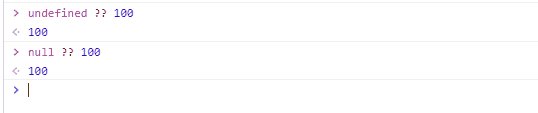
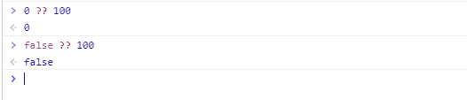

# javascript 空合并运算符

> 原文：<https://www.studytonight.com/javascript/javascript-nullish-coalescing-operator>

**无效合并**在 **ECMAScript 2020** 中推出。用`??`双问号表示。

该运算符是**逻辑 or 运算符** ( `||`)的改进版本。**无效合并**运算符的工作方式与**逻辑或运算符**非常相似。唯一不同的是它**检查**值是否为**null**而不是 **falsy** 。这意味着如果**左侧**的值为**空值**和**未定义**，操作符将返回其**右侧**操作数**操作数**。

这里有一个表格，列出了什么被认为是虚假值，什么是无效值。

| 虚假价值观 | 看涨价值 |
| --- | --- |
| 不明确的 | 不明确的 |
| 空 | 空 |
| Zero | - |
| 错误的 | - |
| 圆盘烤饼 | - |

如果用于[如果...否则声明](https://www.studytonight.com/javascript/javascript-if-else-and-else-if-statements)，虚假值视为**虚假**。

无效合并运算符的**第五低**运算符优先级，它比逻辑的**或**运算符直接低**，比条件的**运算符高**。******

 ******### 无效合并的语法:

以下是使用 nullish 合并运算符的语法:

```
left_expression ?? right_expression
```

让我们借助一个例子来理解它

## 使用无效合并运算符:

如上所述，无效合并操作符**仅为**无效值**设置回退值**(未定义且为空)。因此，当我们在**未定义**或**为空**的情况下使用该运算符时，它将返回回退值(右侧值)，如图所示。



当我们将此运算符与其他虚假值一起使用时，如**零**、**假**、**楠**等。，则**将返回****左侧值**，如图所示。



### 示例:

在给定的示例中，有一个对象名`person`具有两个属性`name`和`age`。首先，我们使用**逻辑 OR 运算符**将这两个属性的值与**回退值**进行了比较。然后我们使用**无效合并操作符**比较了相同的属性。

```
<!DOCTYPE html>
<html>
<head>
	<title>Nullish Coalescing</title>
</head>
<body>
	<script type="text/javascript">
		let person = {
		profile: {
		name: "",
		age: 0
		}
		};

		console.log(person.profile.name || "Anonymous"); 
		console.log(person.profile.age || 18); 

		console.log(person.profile.name ?? "Anonymous"); 
		console.log(person.profile.age ?? 18); 
	</script>
</body>
</html>
```

### 输出:

正如我们在输出图像中看到的，前两个输出是**右侧值**。之所以会出现这种情况，是因为如果**的左操作数**不是**的空值**，则**逻辑 OR** 运算符`||`返回**的右操作数**，而如果**的左操作数**既不是**的空值**，也不是**的未定义值**，则**逻辑 OR**运算符`??`返回**的空值。**


## 结论

**无效合并运算符**是逻辑或运算符的扩展。此运算符仅检查左操作数是空还是未定义。

* * *

* * *******