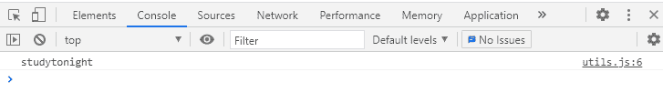
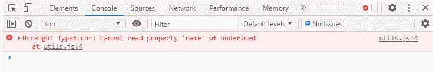

# JavaScript 可选链接运算符

> 原文：<https://www.studytonight.com/javascript/javascript-optional-chaining-operator>

新的 Javascript **可选链接运算符**在 **ECMAScript 2020** 中引入，也称为 **ES11** 或 **ES 2020** 。用`?.`(问号、点)表示。

**可选链接**只不过是一个**语法**，借助它我们可以**访问 [Javascript 对象](https://www.studytonight.com/javascript/javascript-objects)中的深度嵌套属性**，而无需检查该属性是否存在。不是返回一个对象，而是返回 **null** 或 **undefined** 。

## 可选链接运算符的语法:

以下是使用可选链接运算符的语法，

```js
obj.val?.prop
obj.val?.[expr]
obj.arr?.[index]
obj.func?.(args)
```

让我们借助一些例子来理解它。

## 使用可选链接运算符:

在给定的代码中，有一个**嵌套对象**(对象内部的对象)。有一个对象`obj`的值是一个**人**，其中`person`是另一个对象，有一个属性`name`值**今晚学习**。

```js
let obj = {
	person: {
		name: 'studytonight'
	}
};
console.log(obj.person.name);
```

当我们试图访问嵌套对象的`name`属性时，我们将得到**“今晚学习”**如输出图像所示。



### 理解没有可选链接的问题:

现在假设`person`对象没有`name`属性。现在，当我们试图访问`obj.person.name`时，我们将得到**未定义的**。

```js
let obj = {
	person: {

	}
};
console.log(obj.person.name);
```

以下是输出:


上面的代码运行良好，因为`person`对象存在，但其属性未定义。但是如果物体`person`也不存在呢？然后，Javascript 会抛出一个错误，因为我们试图访问一个不存在的属性。

让我们进一步修改上面的代码，删除`person`对象。现在，当我们试图访问相同的属性时，我们会得到一个错误。

```js
let obj = {

};
console.log(obj.person.name);
```

出现错误是因为`obj.person`已经未定义，我们试图访问未定义实体`obj.person`的属性`name`。



在早期的 Javascript 中，我们曾经有检查来处理这种类型的错误或者避免意外的 Javascript 错误。但现在不是了！

### 可选链接在这里！

当我们试图**访问深度嵌套对象**时，处理**意外 JavaScript 错误**的更简单方法是使用**可选链接运算符**。

现在我们将使用**可选链接运算符**访问上面给出的相同代码。

```js
let obj = {

};
console.log(obj?.person?.name);
```

如我们所见，我们将得到**未定义的**，而不是**错误**。发生这种情况是因为**可选链接操作符**。


因此，我们不必应用特殊的检查来查看嵌套属性是否存在，我们可以简单地使用可选的链式运算符。

## 可选链接运算符的优势:

*   更容易使用，代码更少。

*   增加了人的可读性，减少了检查空值的假设条件。

*   有助于避免错误。

*   当我们试图访问深度对象属性时，这将非常有用。

## 结论:

**可选链接操作符**对于**深度检查****嵌套对象**非常有用。它允许我们**避免为**检查****属性**的存在而写几个检查**和**语句**。

* * *

* * *