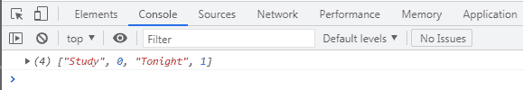
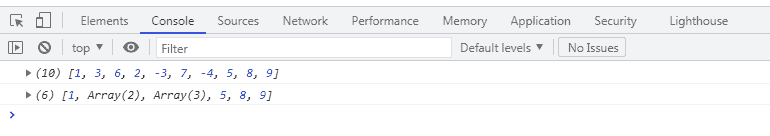

# JavaScript `Array.flaMap()`方法

> 原文：<https://www.studytonight.com/javascript/javascript-arrayflatmap-method>

`Array.flatMap()`法引入于 **ECMA 剧本 2019** 或 **ES10** 。此方法用于展平嵌套数组。

之前学过`flat()`法，也是用来**压平**的**嵌套阵，**但是两种方法略有不同。

`Array.flaMap()`法是`map()` 法和`flat()`法的结合。此方法首先使用映射函数映射数组中的每个元素，然后将数组和结果展平为一个新数组。

这个方法可以用来**展平**深度 1** 的**数组**只是因为它调用了一个 map()函数后跟一个深度为 1 的 flat()函数。**

### 句法

```
// Arrow function
flatMap((currentValue) => { ... } )
flatMap((currentValue, index) => { ... } )
flatMap((currentValue, index, array) => { ... } )

// Callback function
flatMap(callbackFn)
flatMap(callbackFn, thisArg)

// Inline callback function
flatMap(function callbackFn(currentValue) { ... })
flatMap(function callbackFn(currentValue, index) { ... })
flatMap(function callbackFn(currentValue, index, array){ ... })
flatMap(function callbackFn(currentValue, index, array) { ... }, thisArg)
```

### 因素

*   **回调-** 它是一个产生新数组元素的函数，采用三个参数:
    *   **当前值-** 数组中正在处理的当前元素。
    *   **索引(可选)-** 数组中正在处理的当前元素的索引。
    *   **数组(可选)-** 调用数组映射。
*   **该参数(可选)** -执行回调时用作该参数的值。

### 返回值

返回一个新数组，其中每个元素都是回调函数的结果，并被展平到 1 的深度。

### 例 1

在给定的例子中，我们使用`flatMap()`方法将**映射到**数组的元素。

```
<!DOCTYPE html>
<html>
<head>
	<title>flatMap()</title>
</head>
<body>
	<script type="text/javascript">
		const names = ['Study', 'Tonight'];
		const result = names.flatMap((name, index) => [name, index]);
		console.log(result);
	</script>
</body>
</html>
```

### 输出



### 示例:使用 flatMap()方法过滤数组元素

在给定的例子中，我们创建了一个名为**数字的**嵌套数组**。**

首先，我们使用`flat()`方法将**展平**阵列，然后我们使用`flatMap().`方法将从阵列中移除**负数**。

```
<!DOCTYPE html>
<html>
<head>
	<title>flatMap()</title>
</head>
<body>
	<script type="text/javascript">
		const numbers = [1, [3, 6,], [2, -3, 7, ], [-4,], 5, 8, 9];

		console.log(numbers.flat(3));

		const result = numbers.flatMap(number => {
		return number < 0 ? [] : [number];
		});

		console.log(result);
	</script>
</body>
</html>
```

### 输出

正如我们在输出中看到的，有两个数组。第一个数组是我们使用`flat()`得到的平坦数组。

第二个数组是过滤数组，其中我们已经使用`flatMap()`方法过滤了负数。



### 结论

`flatMap()` 方法由 ECMAScript 2019 推出，也称为 ES 10。该方法由属性`map()`方法和`flat()`方法组成。这个方法**首先映射数组中的每个元素**，然后将其展平，得到一个新的数组。

* * *

* * *