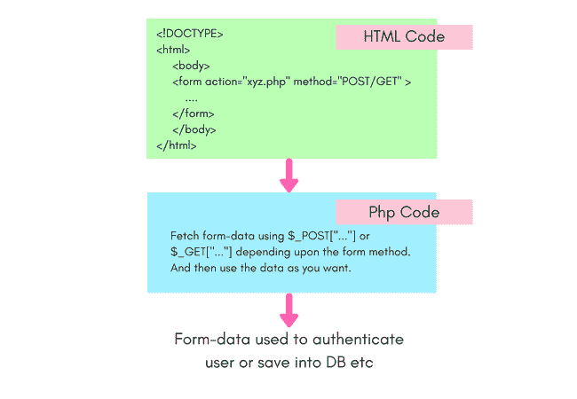

# PHP 表单处理

> 原文：<https://www.studytonight.com/php/php-form-handling>

当我们开发一个网站或者一个网络应用程序时，我们经常需要创建一些表格来接受用户的输入，比如**登录**表格或者**注册**表格。

在网页上创建表单是使用 [HTML](/code/html/) 来完成的，而 PHP 则是将这些值从网页传输到服务器，然后进一步处理这些值。

PHP 提供了两个**超级全局** `$_GET`和`$_POST`来收集表单数据进行处理。

* * *

## 理解 HTML 表单的工作原理

让我们创建一个简单的 HTML 表单，并尝试理解它是如何工作的，在`<form>`标签中有哪些不同的可用属性，以及它们用于什么。

```
<html>
    <body>

        <form action="form-handler.php" method="POST">
            Name: <input type="text" name="name"> <br/>
            Email: <input type="text" name="email"> <br/>
            <input type="submit">
        </form>

    </body>
</html>
```

在上面的代码中，我们使用了`<form>`标签来创建一个 HTML 表单，在表单数据的提交按钮上有名称和电子邮件的输入字段。

在`<form>`标签中，我们有两个属性，`action`和`method`，你知道它们是干什么的吗？

1.  `action`:使用这个属性，我们可以指定将要收集和处理表单数据的文件名。在上面的例子中，我们提供了一个 Php 文件的名称。
2.  `method`:该属性指定发送表单数据的方式，是通过 **POST** 方式还是 **GET** 方式提交。

下面我们用`method`和**一样的形式得到**，

```
<html>
    <body>

        <form action="form-handler.php" method="GET">
            Name: <input type="text" name="name"> <br/>
            Email: <input type="text" name="email"> <br/>
            <input type="submit">
        </form>

    </body>
</html>
```

* * *

## 用开机自检处理 PHP 表单

如果我们将表单方法指定为 **POST** ，那么表单数据将使用 HTTP POST 方法发送到服务器。

下面，我们有代码，访问在我们的 HTML 表单的`action`属性中指定的 Php 文件中的表单数据。

```
<?php

// getting the value of name field
$name = $_POST["name"];
// getting the value of the email field
$email = $_POST["email"];

echo "Hi, ". $name . "<br>";
echo "Your email address: ". $email ."<br>";

?>
```

嗨，今晚学习你的电子邮件地址:we@studytonight.com

如果您提供的姓名为“Studytonight”，电子邮件地址为“we @ studytonight.com”，您将获得上述输出。

* * *

## 用 GET 处理 PHP 表单

如果我们将表单方法指定为 **GET** ，那么表单数据将使用 HTTP GET 方法发送到服务器。

下面，我们有代码，访问在我们的 HTML 表单的`action`属性中指定的 Php 文件中的表单数据，这次使用 GET superglobal。

```
<?php

// getting the value of name field
$name = $_GET["name"];
// getting the value of the email field
$email = $_GET["email"];

echo "Hi, ". $name . "<br>";
echo "Your email address: ". $email ."<br>";

?>
```

嗨，今晚学习你的电子邮件地址:we@studytonight.com

同样，输出保持不变。

处理表单数据的第一步是使用 POST 或 GET superglobals 获取数据，一旦你有了数据，你可以对它做任何事情，在你的网页上显示它，将数据保存到数据库，执行验证等。



* * *

## 获取与发布:何时使用什么！

现在，你一定想知道，我们应该用哪一个。好吧，GET 和 POST 都用于相同的目的，但是它们的工作方式不同。

当用户提交表单时，输入字段中的值存储在一个数组中，如`array(key1=>value1, key2=>value2,...)`，然后传递到`<form>`标签的`action`属性中指定的目标(Php 文件)。

* * *

### 使用 GET 方法

在 **GET** 方法的情况下，表单数据作为 URL 参数提交，即用户在表单字段中输入的所有值都被发送到动作脚本，并附加在 URL 中。

让我们举一个简单的例子来理解，下面我们有一个简单的 HTML 表单，

```
<html>
    <body>

        <form action="form-handler.php" method="GET">
            Name: <input type="text" name="name"> <br/>
            Age: <input type="text" name="age"> <br/>
            <input type="submit">
        </form>

    </body>
</html>
```

上表我们有两个输入字段，一个是**姓名**，另一个是**年龄**。当我们点击提交时，我们将被重定向到以下网址:**form-handler.php？名称=今晚学习&年龄=5** ，表单数据附加到网址。

将表单数据作为网址参数发送有时被证明是有用的，因为您可以很容易地**将链接添加到表单数据**中，但是在网址中添加参数有 **2000 个字符的限制**，因此对于具有大量字段的表单，不建议这样做，因为一些数据可能会丢失或者表单提交可能会导致错误。

Php 文件**form-handler.php**看起来像，

```
<?php

// name attribute of the input field goes inside the 
// square brackets of $_GET superglobal
$name = $_GET["name"];
$age = $_GET["age"];

echo "Your name is ". $name . " and you are ". $age . " years old".

?>
```

你的名字是今晚学习，你 5 岁了

由于表单数据对每个人都是可见的，因为它是作为网址参数发送的，因此我们不应该对带有**敏感数据**的表单使用 GET 方法，比如密码等。

* * *

### 使用开机自检方法

当我们使用 POST 方法时，来自 HTML 表单的键值对数组(表单数据)作为 HTTP 请求的一部分被发送，因此它们对用户是不可见的。

此外，正在传输的信息/数据没有**字符限制**。

POST 方法也**支持多部分表单-数据**上传，用于文件上传。

我们建议您在处理任何 PHP 网络应用程序/项目时使用 POST 方法。

让我们举一个简单的例子来理解，下面我们有一个简单的 HTML 表单，

```
<html>
    <body>

        <form action="form-handler.php" method="POST">
            Name: <input type="text" name="name"> <br/>
            Age: <input type="text" name="age"> <br/>
            <input type="submit">
        </form>

    </body>
</html>
```

Php 文件**form-handler.php**看起来像，

```
<?php

// name attribute of the input field goes inside the 
// square brackets of $_POST superglobal
$name = $_POST["name"];
$age = $_POST["age"];

echo "Your name is ". $name . " and you are ". $age . " years old".

?>
```

你的名字是今晚学习，你 5 岁了

* * *

* * *