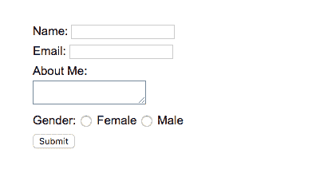

# PHP 表单处理示例

> 原文：<https://www.studytonight.com/php/php-form-handling-example>

在本教程中，我们将使用不同类型的输入创建一个简单的 [HTML](/code/html/) 表单，然后编写 PHP 代码来处理提交时的表单数据。

我们还将学习一些有用的技巧，可以在处理表单数据时使用，如检查空输入值、验证字段等。让我们开始吧。

* * *

## 超文本标记语言表单

我们将创建一个 HTML 表单，其中 2 个文本字段用于姓名和电子邮件，1 个文本区域用于用户提供自我描述(更像是关于我的)和一个询问用户性别的单选按钮集。

下面是表单的 HTML 代码。

```
<html>
    <body>

        <form action="form-handler.php" method="POST">

            Name: <input type="text" name="name"> <br/>
            Email: <input type="text" name="email"> <br/>

            About Me:<br/> 
            <textarea name="aboutme"></textarea> <br/>

            Gender: 
            <input type="radio" name="gender" value="female"> Female
            <input type="radio" name="gender" value="male"> Male
            <br/>
            <input type="submit" name="submit" value="Submit">
        </form>

    </body>
</html>
```



* * *

## PHP 代码

在上面的表单中，我们要求用户提供 4 种不同的输入，让我们看看如何获取 PHP 中字段的提交值。

```
<?php

// getting the value of name field
$name = $_POST["name"];
// getting the value of the email field
$email = $_POST["email"];
// getting the value of the aboutme field
$aboutme = $_POST["aboutme"];
// getting the value of the radio buttons
$gender = $_POST["gender"];

?>
```

很简单，对吧？是的，要访问不同类型的 HTML 表单元素的表单数据，您需要的只是`$_POST`。

但是一个 HTML 表单是一个很好的切入点，黑客可以通过在输入字段中输入脚本或一些恶意代码来在您的 PHP 脚本中造成一些错误/问题。

为了解决这个问题，最好在 PHP 代码中加入一些验证，以验证表单数据中提交的用户输入。

* * *

### PHP 表单验证

现在，我们将学习一些基本的验证，这些验证可以很容易地应用于提交的表单数据，以便在对其执行任何操作之前对其进行验证。

```
<?php

// getting the value of name field
$name = $_POST["name"];
// check if name is empty or not
if(empty($name)) {
    echo "Name is required";
}

?>
```

在上面的代码中，我们正在检查用户是否在表单中输入了**名称**值，类似地，您可以检查所有必需的表单字段。

为了验证电子邮件地址，PHP 中有一个特殊的函数，我们可以用它来验证电子邮件地址。功能是`filter_var($email, FILTER_VALIDATE_EMAIL)`，让我们看看它是如何工作的。

```
<?php

// getting the value of the email field
$email = $_POST["email"];

// checking if the email value is valid
if(!filter_var($email, FILTER_VALIDATE_EMAIL)) {
    echo "Email value invalid";
}

?>
```

`filter_var()`功能返回`true`为有效的电子邮件地址，返回`false`为无效的电子邮件地址。

用 PHP 验证表单也取决于您的需求。例如，如果您的表单中没有任何必填字段，那么您就不必担心检查提交的值是否为空。

如果您有电子邮件地址字段，我们建议您验证它。

您甚至可以添加更多的验证，例如使用正则表达式检查输入中的恶意代码，如`<script>`标签。

* * *

## 什么是`$_SERVER["PHP_SELF"]`？

有时我们可以避免使用额外的 PHP 文件来处理表单数据，并且可以将 PHP 代码包含在 HTML 表单本身的文件中。

在这种情况下，我们将不得不再次将表单提交到同一个网页，我们可以使用`$_SERVER["PHP_SELF"]`作为表单**动作**。

```
<form action="<?php echo $_SERVER["PHP_SELF"];  ?>" method="POST"> 
```

这个 superglobal 的作用是返回当前网页的文件名，然后作为动作脚本。

但是由于这将从 URL 中返回现有的文件名，您必须小心一点，因为用户可能会从 URL 中注入一些不需要的代码，因此为了避免这种情况，我们可以使用`htmlspecialchars()`函数将字符串(本例中为 URL)中的任何特殊字符转换为 HTML 实体。

所以你应该用，

```
<form action="<?php echo htmlspecialchars($_SERVER["PHP_SELF"]);  ?>" method="POST"> 
```

* * *

* * *