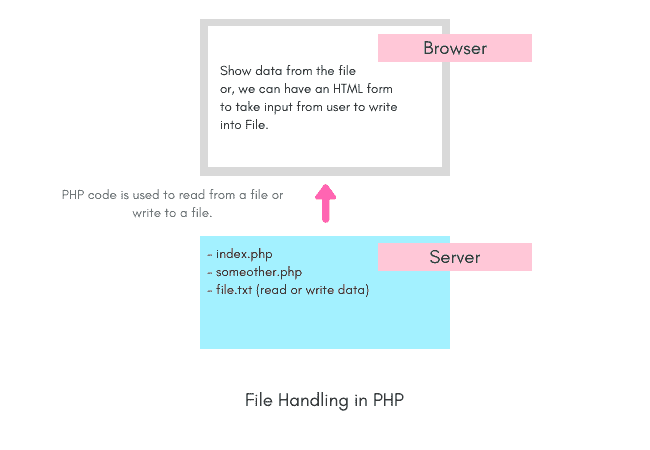

# PHP 中的文件处理

> 原文：<https://www.studytonight.com/php/php-file-handling>

当我们使用 PHP 开发一个 web 应用程序时，我们经常需要处理外部文件，比如从文件中读取数据，或者将用户数据写入文件等。因此，在使用任何 web 应用程序时，了解文件是如何处理的非常重要。

* * *

## 文件处理操作

文件处理从创建文件、读取其内容、写入文件以将数据附加到现有文件中，最后关闭文件开始。Php 为所有这些操作提供了预定义的函数，所以让我们从了解这些函数开始。

1.  **创建文件** : `fopen()`
2.  **打开文件** : `fopen()`
3.  **读取文件** : `fread()`
4.  **写入文件** : `fwrite()`
5.  **追加到文件** : `fwrite()`
6.  **关闭文件** : `fclose()`
7.  **删除文件** : `unlink()`

你一定想知道为什么我们为多个文件操作指定了相同的函数，那是因为仅仅通过改变一个或多个参数，相同的函数就可以用来对文件执行多个操作。

在接下来的教程中，我们将学习如何使用这些函数以及代码示例。

* * *

## 文件在应用程序中的使用

以下是我们在 web 应用程序中需要文件的一些实际用例。

*   数据通常存储在 JSON 文件的 for 中，而 Php 代码必须读取该文件，然后将数据显示在网页上。
*   在一些简单的应用程序中，不使用数据库，而是将数据存储在文件中。
*   在某些 web 应用程序中，您可能必须准备一个文件供用户下载，在这种情况下，Php 代码将创建一个文件，在其中写入数据，然后允许用户下载。

上面的用例只是为了说明通常需要文件处理。

* * *

* * *